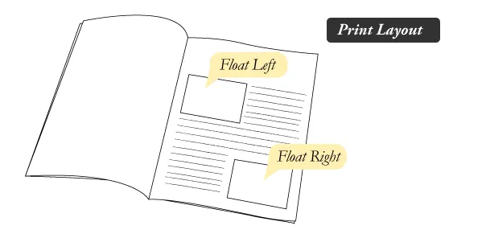
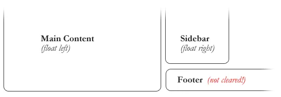
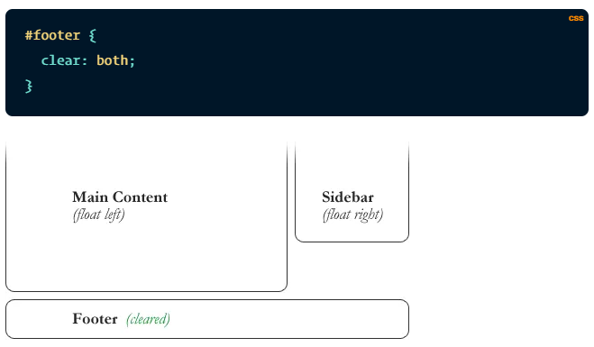

# Table of contents
|Read No. | Name of chapter|
|:---------: |:--------------:|
|1| [Shay Howe’s intro to RWD](Shay-Howe's-intro-to-RWD.md)
|1| [All about float](All-about-floats.md)
|1| [Don't Overthink it grids](Don't-overthink-it-grids.md)

# Responsive Web Design

## Responsive Overview

### Responsive web design is the practice of building a website suitable to work on every device and every screen size, no matter how large or small, mobile or desktop.

## Flexible Layouts
### Responsive web design is broken down into three main components, including:

- flexible layouts
- media queries
- flexible media

### The first part, flexible layouts, is the practice of building the layout of a website with a flexible grid, capable of dynamically resizing to any width. Flexible grids are built using relative length units, most commonly percentages or em units. These relative lengths are then used to declare common grid property values such as width, margin, or padding.

### Flexible layouts do not advocate the use of fixed measurement units, such as pixels or inches. Reason being, the viewport height and width continually change from device to device. Website layouts need to adapt to this change and fixed values have too many constraints. Fortunately, Ethan pointed out an easy formula to help identify the proportions of a flexible layout using relative values.

### The formula is based around taking the target width of an element and dividing it by the width of it’s parent element. The result is the relative width of the target element.

## Media Queries:

## Initializing Media Queries
### Each media query may include a media type followed by one or more expressions. Common media types include all, screen, print, tv, and braille. The HTML5 specification includes new media types, even including 3d-glasses. Should a media type not be specified the media query will default the media type to screen.The media query expression that follows the media type may include different media features and values, which then allocate to be true or false. When a media feature and value allocate to true, the styles are applied. If the media feature and value allocate to false the styles are ignored.

## Logical Operators in Media Queries
### Logical operators in media queries help build powerful expressions. There are three different logical operators available for use within media queries, including *and* , *not*, and *only*.

### Using the and logical operator within a media query allows an extra condition to be added, making sure that a browser or devices does both a, b, c, and so forth. Multiple individual media queries can be comma separated, acting as an unspoken or operator. The example below selects all media types between 800 and 1024 pixels wide.

### The not logical operator negates the query, specifying any query but the one identified. In the example below the expression applies to any device that does not have a color screen. Black and white or monochrome screens would apply here for example.

### The only logical operator is a new operator and is not recognized by user agents using the HTML4 algorithm, thus hiding the styles from devices or browsers that don’t support media queries. Below, the expression selects only screens in a portrait orientation that have a user agent capable of rending media queries.

## Mobile First
### One popular technique with using media queries is called mobile first. The mobile first approach includes using styles targeted at smaller viewports as the default styles for a website, then use media queries to add styles as the viewport grows.The operating belief behind mobile first design is that a user on a mobile device, commonly using a smaller viewport, shouldn’t have to load the styles for a desktop computer only to have them over written with mobile styles later. Doing so is a waste of bandwidth. Bandwidth that is precious to any users looking for a snappy website.

## Viewport
### Mobile devices generally do a pretty decent job of displaying websites these days. Sometimes they could use a little assistance though, particularly around identifying the viewport size, scale, and resolution of a website. To remedy this, Apple invented the viewport meta tag.

## Flexible Media
### The final, equally important aspect to responsive web design involves flexible media. As viewports begin to change size media doesn’t always follow suit. Images, videos, and other media types need to be scalable, changing their size as the size of the viewport changes.One quick way to make media scalable is by using the max-width property with a value of 100%. Doing so ensures that as the viewport gets smaller any media will scale down according to its containers width.

# All About Floats

## What is “Float”?

### Float is a CSS positioning property. To understand its purpose and origin, we can look to print design. In a print layout, images may be set into the page such that text wraps around them as needed. This is commonly and appropriately called “text wrap”. Here is an example of that.

### In page layout programs, the boxes that hold the text can be told to honor the text wrap, or to ignore it. Ignoring the text wrap will allow the words to flow right over the image like it wasn’t even there. This is the difference between that image being part of the flow of the page (or not). Web design is very similar.

### In web design, page elements with the CSS float property applied to them are just like the images in the print layout where the text flows around them. Floated elements remain a part of the flow of the web page. This is distinctly different than page elements that use absolute positioning. Absolutely positioned page elements are removed from the flow of the webpage.

### There are four valid values for the float property. Left and Right float elements those directions respectively. None (the default) ensures the element will not float and Inherit which will assume the float value from that elements parent element.

## What are floats used for?
### Aside from the simple example of wrapping text around images, floats can be used to create entire web layouts.

## Clearing the Float

### Float’s sister property is clear. An element that has the clear property set on it will not move up adjacent to the float like the float desires, but will move itself down past the float. Again an illustration probably does more good than words do.

### In the above example, the sidebar is floated to the right and is shorter than the main content area. The footer then is required to jump up into that available space as is required by the float. To fix this problem, the footer can be cleared to ensure it stays beneath both floated columns.

### Clear has four valid values as well. Both is most commonly used, which clears floats coming from either direction. Left and Right can be used to only clear the float from one direction respectively. None is the default, which is typically unnecessary unless removing a clear value from a cascade. Inherit would be the fifth, but is strangely not supported in Internet Explorer. Clearing only the left or right float, while less commonly seen in the wild, definitely has its uses.

## Techniques for Clearing Floats

### *The Empty Div Method* is, quite literally, an empty div. 

. Sometimes you’ll see a   element or some other random element used, but div is the most common because it has no browser default styling, doesn’t have any special function, and is unlikely to be generically styled with CSS. This method is scorned by semantic purists since its presence has no contextual meaning at all to the page and is there purely for presentation. Of course in the strictest sense they are right, but it gets the job done right and doesn’t hurt anybody.

### *The Overflow Method* relies on setting the overflow CSS property on a parent element. If this property is set to auto or hidden on the parent element, the parent will expand to contain the floats, effectively clearing it for succeeding elements. This method can be beautifully semantic as it may not require additional elements. However if you find yourself adding a new div just to apply this, it is equally as non-semantic as the empty div method and less adaptable. Also bear in mind that the overflow property isn’t specifically for clearing floats. Be careful not to hide content or trigger unwanted scrollbars.

### *The Easy Clearing Method* uses a clever CSS pseudo selector (:after) to clear floats. Rather than setting the overflow on the parent, you apply an additional class like “clearfix” to it.

## Problems with Floats
- *Pushdown* is a symptom of an element inside a floated item being wider than the float itself (typically an image). Most browsers will render the image outside the float, but not have the part sticking out affect other layout. IE will expand the float to contain the image, often drastically affecting layout. Quick fix: Make sure you don’t have any images that do this, use overflow: hidden to cut off excess.

- *Double Margin Bug* – Another thing to remember when dealing with IE 6 is that if you apply a margin in the same direction as the float, it will double the margin. Quick fix: set display: inline on the float, and don’t worry it will remain a block-level element.

- *The 3px Jog* is when text that is up next to a floated element is mysteriously kicked away by 3px like a weird forcefield around the float. Quick fix: set a width or height on the affected text.

- *In IE 7*, the Bottom Margin Bug is when if a floated parent has floated children inside it, bottom margin on those children is ignored by the parent. Quick fix: using bottom padding on the parent instead.

# Don’t Overthink It Grids

## Context
### A block level element is as wide as the parent it’s inside (width: auto;). We can think of it as 100% wide. The wrapper for a grid probably don’t have much to do with semantics, it’s just a generic wrapper, so a div is fine.

## Columns
### Let’s start with a practical and common need: a main content area being 2/3 the width and a sidebar being 1/3 the width. We just make two column divs with appropriate class names. To make them next to each other, we just need to float them and apply widths.

## Clearing Context
### The parent element will collapse to zero height since it has only floated children. Let’s fix that by clearing it.

