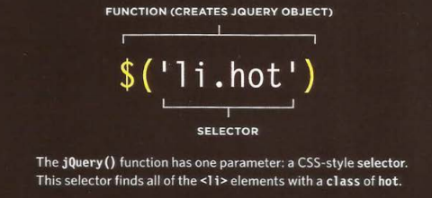
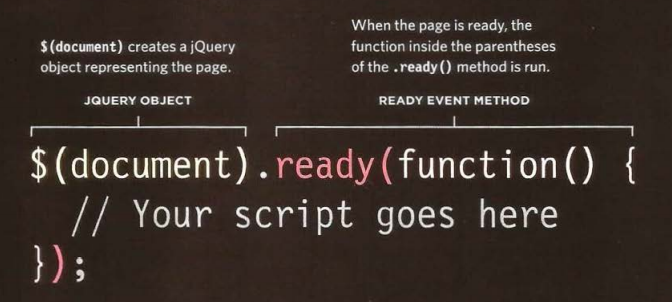
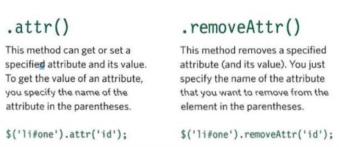

# Table of contents

|Read No. | Name of chapter|
|:---------: |:--------------:|
|2|[jQuery book by Jon Duckett](jQuery-book-by-Jon-Duckett.md)
|2|[6 Reasons for Pair Programming](Reasons-for-Pair-Programming.md)

# jQuery 
## What is JQuery?
## jQuery is a javaScript file that you include in your web pages. It lets you find elements using CSS-style selectore and then do something with the elements using jQuery methods.

## Find elements using CSS-style selectors:

### A function called jQuery lets you find one or more elements in the page. It creates an object called jQuery which holds refernces to thoes elements. $() is often used as a shorthand to save typing jQuery, as show here.

### The jQuery object has many methods that you can use to work with the elements you select. The methods represent tasks that you commonly need to perform with element.

## WHY USE JQUERY? 
### jQuery doesn't do anything you cannot achieve with pure JavaScript. It is just a JavaScript file but estimates show it has been used on over a quarter of the sites on the web, because it makes coding simpler. 

## A mathched set/ JQuery selection 

## jquery methods that get and set data
### Some jQuery methods both retrieve information from, and update the contents of, elements. But they do not always apply to all elements.

## Checking a page is ready to work with
### jQuery's.ready() methode check that the page is ready for your code to work with.

## GETTING ELEMENT CONTENT 
### The • htm 1 () and • text () methods both retrieve and update the content of elements. This page will focus on how to retrieve element content.

## INSERTING ELEMENTS 
### Inserting new elements involves two steps:
1: Create the new elements in a jQuery object

2: Use a method to insert the content into the page.

## GETTING AND SETTING ATTRIBUTE VALUES 

### You can create attributes, or access and update their contents, using the following four methods. 

## GETTING & SETTING CSS PROPERTIES 

### The . css () method lets you retrieve and set the values of CSS properties. 

### HOW TO SET A CSS PROPERTY?
### This will set the background color of all list items. Note how the CSS property and its value are separated using a comma instead of a colon.
### $( 'li ') .css( 'background- color' , '1272727' ); 

## EVENT METHODS
### The .on () method is used to handle all events. 
### Using the .on () method is no different than using any other jQuery method; you:
- Use a selector to create a
jQuery selection.
- Use .on() to indicate which
event you want to respond to.
It adds an event listener to
each element in the selection. 

## JQUERY EVENTS
### UI: focus , blur, change
### KEYBOARD: input, keydown, keyup, keypress
### MOUSE: click, dblclick, mouseup, mousedown, mouseover, mousemove, mouseout, hover*
### FORM: submit, select, change
### DOCUMENT: ready* , load, unload*
### BROWSER: error, resize , scro11 

# 6 Reasons for Pair Programming

## How does pair programming work?
### While there are many different styles, pair programming commonly involves two roles: the Driver and the Navigator. The Driver is the programmer who is typing and the only one whose hands are on the keyboard. Handling the “mechanics” of coding, the Driver manages the text editor, switching files, version control, and—of course writing—code. The Navigator uses their words to guide the Driver but does not provide any direct input to the computer. The Navigator thinks about the big picture, what comes next, how an algorithm might be converted in to code, while scanning for typos or bugs. The Navigator might also utilize their computer as a second screen to look up solutions and documentation, but should not be writing any code.

## Why pair program?

### While learning to code, developers likely study several programming languages. Similar to a foreign language class, there are four fundamental skills that help anyone learn a new language: Listening: hearing and interpreting the vocabulary Speaking: using the correct words to communicate an idea Reading: understanding what written language intends to convey Writing: producing from scratch a meaningful

### Pair programming touches on all four skills: developers explain out loud what the code should do, listen to others’ guidance, read code that others have written, and write code themselves.

### During a five-hour paired lab session, Code Fellows students work on all four of these language-specific skills. The abilities they foster will serve them well in completing assignments, in their own communication and learning, in interviews, and in readiness for a job at a company that utilizes this agile practice.

1. Greater efficiency
It is a common misconception that pair programming takes a lot longer and is less efficient. In reality, when two people focus on the same code base, it is easier to catch mistakes in the making. Research indicates that pair programing takes slightly longer, but produces higher-quality code that doesn’t require later effort in troubleshooting and debugging (let alone exposing users to a broken product). So, in the long-run, it’s often actually more efficient than two people working on separate features. When coming up with ideas and discussing solutions out loud, two programmers may come to a solution faster than one programmer on their own. Also, when the pair is stuck, both programmers can research the problem and reach a solution faster. Researches also identified pairing enhances technical skills, team communication, and even enjoyability of coding in the workplace.

2. Engaged collaboration
When two programmers focus on the same code, the experience is more engaging and both programmers are more focused than if they were working alone. It is harder to procrastinate or get off track when someone else is relying on you to complete the work. Popping open your Facebook timeline is just that less enticing when someone else is looking at your screen.

### Another important aspect of learning to program is knowing when to ask for help. We advise our students to spend no more than fifteen minutes stuck on a problem before asking a teaching assistant or instructor for help. When developers pair program, they rely more on each other and can often find a solution together without needing to ask for additional help. Ultimately, this boosts overall confidence.

3. Learning from fellow students
Everyone has a different approach to problem solving; working with a teammate can expose developers to techniques they otherwise would not have thought of. If one developer has a unique approach to a specific problem, pair programming exposes the other developer to a new solution.

### Often times, the developers in a pairing have different skill sets. If one programmer is more experienced in a certain skill, they can teach a student who is less familiar with that area. The less experienced developer benefits from the experienced developer’s knowledge and guidance, and the latter benefits from explaining the topic in their own words, further solidifying their own understanding.

4. Social skills
Pair programming is great for improving social skills. When working with someone who has a different coding style, communication is key. This can become more difficult when two programmers have different personalities. Pair programming not only improves programming skills, but can also help programmers develop their interpersonal skills. When just grabbing the keyboard and taking over isn’t an option, getting good at finding the right words is a skill unto itself.

### This has long-term career impacts. As much as employers want strong programmers, they know it’s essential to hire people who can work well with others.

5. Job interview readiness
A common step in many interview processes involves pair programming between a current employee and an applicant, either in person or through a shared screen. They will carry out exercises together, such as code challenges, building a project or feature, or debugging an existing code base. By doing so, companies can get a better feel for how an applicant will fit into the team and their collaboration style.

### For most roles, the ability to work with and learn from others and stellar communication skills are as (or more!) important to a company than specific technical skills. Pair programming strengthens all of those skills.

6. Work environment readiness
Many companies that utilize pair programing expect to train fresh hires from CS-degree programs on how they operate to actually deliver a product. Code Fellows graduates who are already familiar with how pairing works can hit the ground running at a new job, with one less hurdle to overcome.

