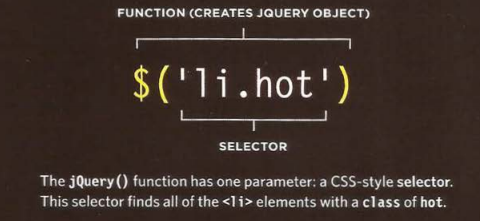
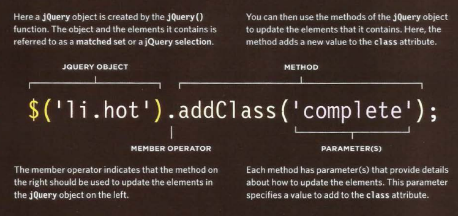
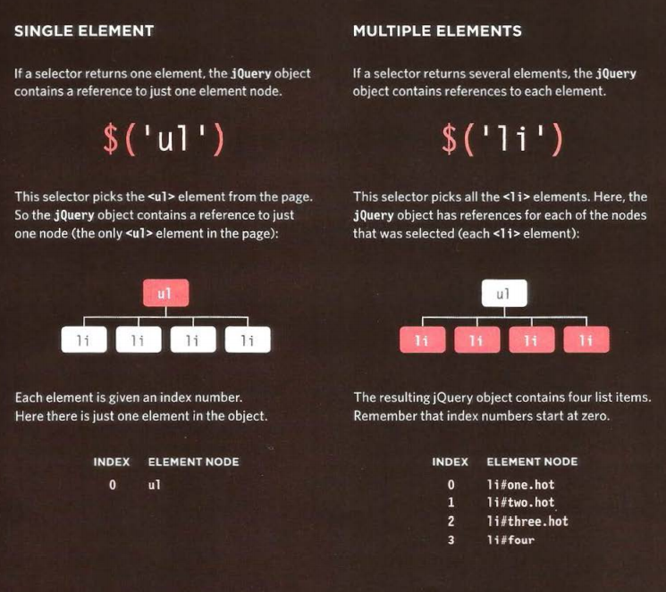
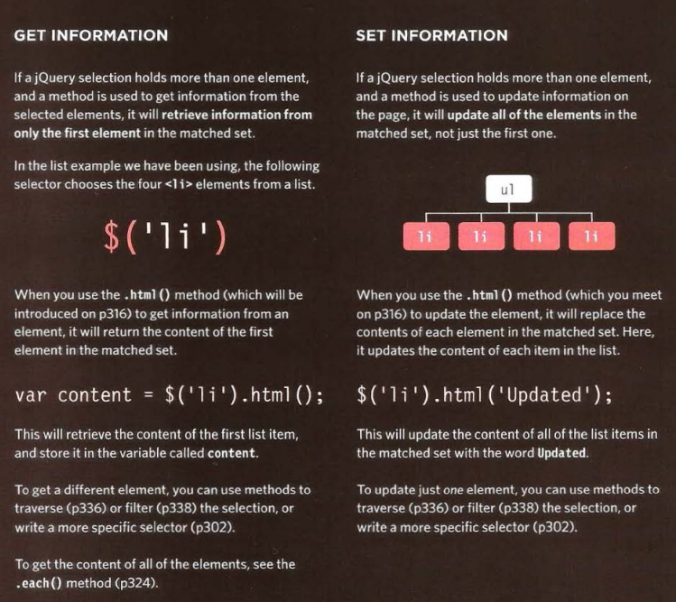
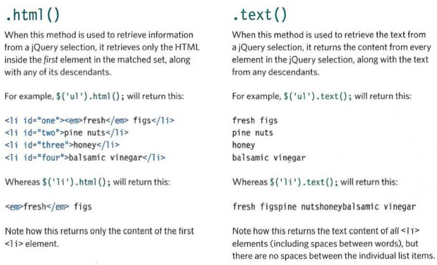
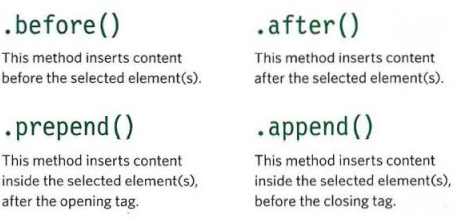
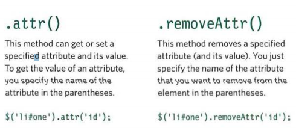
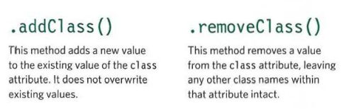

# jQuery 
## What is JQuery?
## jQuery is a javaScript file that you include in your web pages. It lets you find elements using CSS-style selectore and then do something with the elements using jQuery methods.

## Find elements using CSS-style selectors:

### A function called jQuery lets you find one or more elements in the page. It creates an object called jQuery which holds refernces to thoes elements. $() is often used as a shorthand to save typing jQuery, as show here.

### The jQuery object has many methods that you can use to work with the elements you select. The methods represent tasks that you commonly need to perform with element.

## WHY USE JQUERY? 
### jQuery doesn't do anything you cannot achieve with pure JavaScript. It is just a JavaScript file but estimates show it has been used on over a quarter of the sites on the web, because it makes coding simpler. 

## A mathched set/ JQuery selection 

## jquery methods that get and set data
### Some jQuery methods both retrieve information from, and update the contents of, elements. But they do not always apply to all elements.

## Checking a page is ready to work with
### jQuery's.ready() methode check that the page is ready for your code to work with.

## GETTING ELEMENT CONTENT 
### The • htm 1 () and • text () methods both retrieve and update the content of elements. This page will focus on how to retrieve element content.

## INSERTING ELEMENTS 
### Inserting new elements involves two steps:
1: Create the new elements in a jQuery object

2: Use a method to insert the content into the page.

## GETTING AND SETTING ATTRIBUTE VALUES 

### You can create attributes, or access and update their contents, using the following four methods. 

## GETTING & SETTING CSS PROPERTIES 

### The . css () method lets you retrieve and set the values of CSS properties. 

### HOW TO SET A CSS PROPERTY?
### This will set the background color of all list items. Note how the CSS property and its value are separated using a comma instead of a colon.
### $( 'li ') .css( 'background- color' , '1272727' ); 

## EVENT METHODS
### The .on () method is used to handle all events. 
### Using the .on () method is no different than using any other jQuery method; you:
- Use a selector to create a
jQuery selection.
- Use .on() to indicate which
event you want to respond to.
It adds an event listener to
each element in the selection. 

## JQUERY EVENTS
### UI: focus , blur, change
### KEYBOARD: input, keydown, keyup, keypress
### MOUSE: click, dblclick, mouseup, mousedown, mouseover, mousemove, mouseout, hover*
### FORM: submit, select, change
### DOCUMENT: ready* , load, unload*
### BROWSER: error, resize , scro11 

