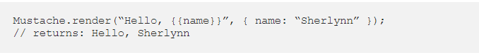
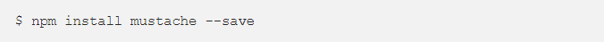

# Javascript Templating Language and Engine— Mustache.js with Node and Express

## Javascript Templating

### Javascript templating is a fast and efficient technique to render client-side view templates with Javascript by using a JSON data source. The template is HTML markup, with added templating tags that will either insert variables or run programming logic. The template engine then replaces variables and instances declared in a template file with actual values at runtime, and convert the template into an HTML file sent to the client.

## Mustache
### Mustache is a logic-less template syntax. It can be used for HTML, config files, source code — anything. It works by expanding tags in a template using values provided in a hash or object. It is often referred to as “logic-less” because there are no if statements, else clauses, or for loops. Instead, there are only tags. Some tags are replaced with a value, some nothing, and others a series of values. mustache.js is an implementation of the mustache template system in JavaScript. It is often considered the base for JavaScript templating. And, since mustache supports various languages, we don’t need a separate templating system on the server side.

### In the above, we see two braces around {{ name }}. This is Mustache syntax to show that it is a placeholder. When Mustache compiles this, it will look for the ‘name’ property in the object we pass in, and replace {{ name }} with the actual value, e,g, “Sherlynn”.

### A confusion that I have initially was that Mustache is a templating engine. However, after some googling, I’ve come to learn that Mustache is NOT a templating engine. Mustache is a specification for a templating language. In general, we would write templates according to the Mustache specification, and it can then be compiled by a templating engine to be rendered to create an output.

## Mustache-Express
### If you intend you use mustache with Node and Express, you can use mustache-express. Mustache Express lets you use Mustache and Express together easily.
### To install:

