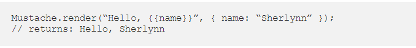
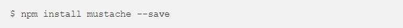
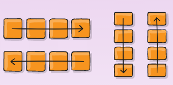
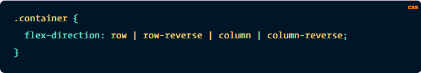
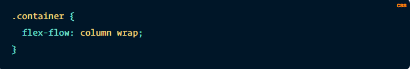
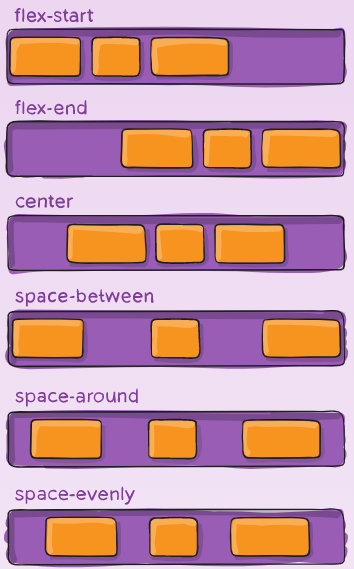
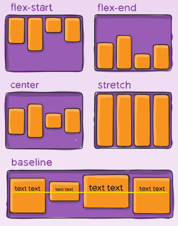
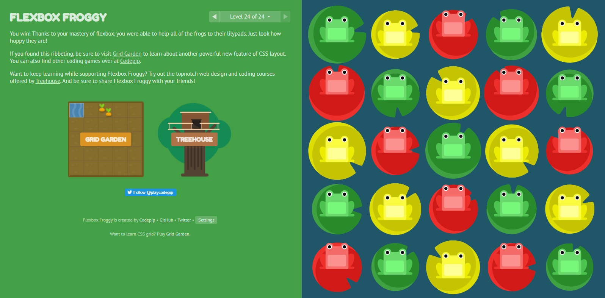

|Read No. | Name of chapter|
|:---------: |:--------------:|
|3|[Templating with Mustache](Mustache.md)
|3|[Flexbox](Flexbox.md)

# Javascript Templating Language and Engine— Mustache.js with Node and Express

## Javascript Templating

### Javascript templating is a fast and efficient technique to render client-side view templates with Javascript by using a JSON data source. The template is HTML markup, with added templating tags that will either insert variables or run programming logic. The template engine then replaces variables and instances declared in a template file with actual values at runtime, and convert the template into an HTML file sent to the client.

## Mustache
### Mustache is a logic-less template syntax. It can be used for HTML, config files, source code — anything. It works by expanding tags in a template using values provided in a hash or object. It is often referred to as “logic-less” because there are no if statements, else clauses, or for loops. Instead, there are only tags. Some tags are replaced with a value, some nothing, and others a series of values. mustache.js is an implementation of the mustache template system in JavaScript. It is often considered the base for JavaScript templating. And, since mustache supports various languages, we don’t need a separate templating system on the server side.

### In the above, we see two braces around {{ name }}. This is Mustache syntax to show that it is a placeholder. When Mustache compiles this, it will look for the ‘name’ property in the object we pass in, and replace {{ name }} with the actual value, e,g, “Sherlynn”.

### A confusion that I have initially was that Mustache is a templating engine. However, after some googling, I’ve come to learn that Mustache is NOT a templating engine. Mustache is a specification for a templating language. In general, we would write templates according to the Mustache specification, and it can then be compiled by a templating engine to be rendered to create an output.

## Mustache-Express
### If you intend you use mustache with Node and Express, you can use mustache-express. Mustache Express lets you use Mustache and Express together easily.
### To install:

# A Complete Guide to Flexbox

## Properties for the Parent (flex container)

### *display:* this defines a flex container; inline or block depending on the given value. It enables a flex context for all its direct children.

### *flex-direction*

### This establishes the main-axis, thus defining the direction flex items are placed in the flex container. Flexbox is (aside from optional wrapping) a single-direction layout concept. Think of flex items as primarily laying out either in horizontal rows or vertical columns.

- *row* (default): left to right in ltr; right to left in rtl

- *row-reverse*: right to left in ltr; left to right in rtl

- *column*: same as row but top to bottom

- *column-reverse*: same as row-reverse but bottom to top

### *flex-wrap*
### By default, flex items will all try to fit onto one line. You can change that and allow the items to wrap as needed with this property.

### Its values:
-  *nowrap* (default): all flex items will be on one line

- *wrap*: flex items will wrap onto multiple lines, from top to bottom.

- *wrap-reverse*: flex items will wrap onto multiple lines from bottom to top.

### *flex-flow*

### This is a shorthand for the flex-direction and flex-wrap properties, which together define the flex container’s main and cross axes. The default value is row nowrap.

### *justify-content*

### This defines the alignment along the main axis. It helps distribute extra free space leftover when either all the flex items on a line are inflexible, or are flexible but have reached their maximum size. It also exerts some control over the alignment of items when they overflow the line.

### *flex-start* (default): items are packed toward the start of the flex-direction.
### *flex-end*: items are packed toward the end of the flex-direction.
### *start*: items are packed toward the start of the writing-mode direction.
### *end*: items are packed toward the end of the writing-mode direction.

### *center*: items are centered along the line
### *space-between*: items are evenly distributed in the line; first item is on the start line, last item on the end line
### *space-around*: items are evenly distributed in the line with equal space around them. Note that visually the spaces aren’t equal, since all the items have equal space on both sides. The first item will have one unit of space against the container edge, but two units of space between the next item because that next item has its own spacing that applies.
### *space-evenly*: items are distributed so that the spacing between any two items (and the space to the edges) is equal.

### *align-items*

### This defines the default behavior for how flex items are laid out along the cross axis on the current line. Think of it as the justify-content version for the cross-axis (perpendicular to the main-axis).

### *stretch* (default): stretch to fill the container (still respect min-width/max-width)

### *center*: items are centered in the cross-axis.

### *baseline*: items are aligned such as their baselines align.

## Properties for the Children (flex items)

### *order*
### By default, flex items are laid out in the source order. However, the order property controls the order in which they appear in the flex container.

### *flex-grow*

### This defines the ability for a flex item to grow if necessary. It accepts a unitless value that serves as a proportion. It dictates what amount of the available space inside the flex container the item should take up.

### If all items have flex-grow set to 1, the remaining space in the container will be distributed equally to all children. If one of the children has a value of 2, the remaining space would take up twice as much space as the others (or it will try to, at least).

### *flex-shrink

### This defines the ability for a flex item to shrink if necessary.

### *flex-basis*
### This defines the default size of an element before the remaining space is distributed. It can be a length (e.g. 20%, 5rem, etc.) or a keyword. The auto keyword means “look at my width or height property” (which was temporarily done by the main-size keyword until deprecated). The content keyword means “size it based on the item’s content” – this keyword isn’t well supported yet, so it’s hard to test and harder to know what its brethren max-content, min-content, and fit-content do.

### *flex*
### This is the shorthand for flex-grow, flex-shrink and flex-basis combined. The second and third parameters (flex-shrink and flex-basis) are optional. The default is 0 1 auto, but if you set it with a single number value, it’s like 1 0.

### *align-self*
### This allows the default alignment (or the one specified by align-items) to be overridden for individual flex items.

