# Introduction to SQL

## What is SQL?
### SQL, or Structured Query Language, is a language designed to allow both technical and non-technical users query, manipulate, and transform data from a relational database. And due to its simplicity, SQL databases provide safe and scalable storage for millions of websites and mobile applications.

## Relational databases
### A relational database represents a collection of related (two-dimensional) tables. Each of the tables are similar to an Excel spreadsheet, with a fixed number of named columns (the attributes or properties of the table) and any number of rows of data.

## SELECT queries
### To retrieve data from a SQL database, we need to write SELECT statements, which are often colloquially refered to as queries. A query in itself is just a statement which declares what data we are looking for, where to find it in the database, and optionally, how to transform it before it is returned.

### the most basic query we could write would be one that selects for a couple columns (properties) of the table with all the rows (instances).
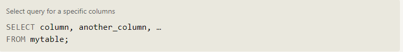

### If we want to retrieve absolutely all the columns of data from a table, we can then use the asterisk (*) shorthand in place of listing all the column names individually.
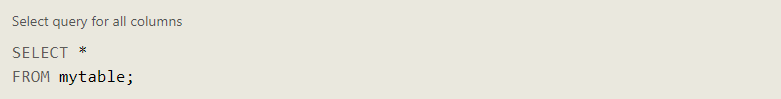

## Queries with constraints
### *WHERE* clause is applied to each row of data by checking specific column values to determine whether it should be included in the results or not.
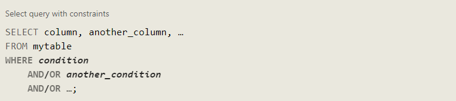
### More complex clauses can be constructed by joining numerous *AND* or *OR* logical keywords.
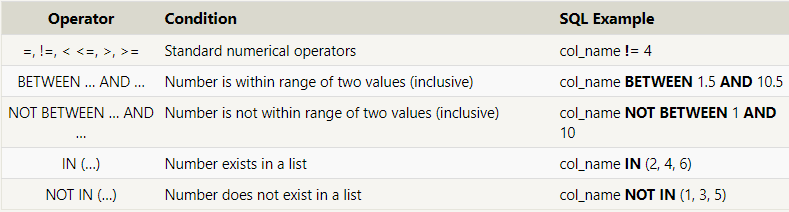

### When writing *WHERE* clauses with columns containing text data, SQL supports a number of useful operators to do things like case-insensitive string comparison and wildcard pattern matching.
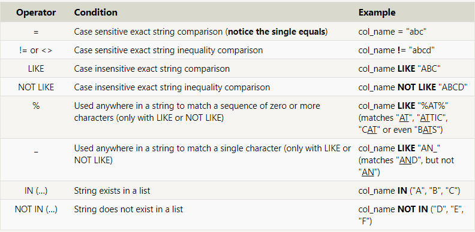

## Filtering and sorting Query results
### SQL provides a convenient way to discard rows that have a duplicate column value by using the *DISTINCT* keyword.
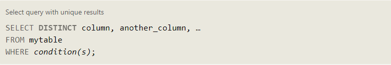

## Ordering results
### Most data in real databases are added in no particular column order. As a result, it can be difficult to read through and understand the results of a query as the size of a table increases to thousands or even millions rows.       To help with this, SQL provides a way to sort your results by a given column in ascending or descending order using the *ORDER BY* clause.When an ORDER BY clause is specified, each row is sorted alpha-numerically based on the specified column's value. 
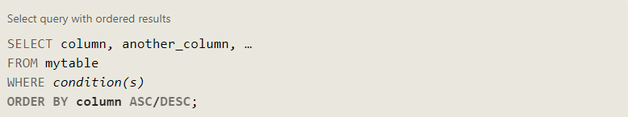

## Limiting results to a subset
### Another clause which is commonly used with the ORDER BY clause are the LIMIT and OFFSET clauses, which are a useful optimization to indicate to the database the subset of the results you care about. The LIMIT will reduce the number of rows to return, and the optional OFFSET will specify where to begin counting the number rows from.

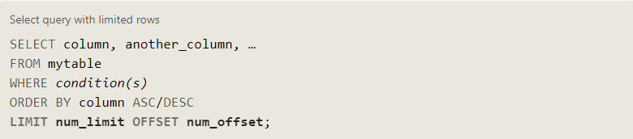

# Inserting rows

## What is a Schema?

### SQL, the database schema is what describes the structure of each table, and the datatypes that each column of the table can contain.

## Inserting new data

### we need to use an INSERT statement, which declares which table to write into, the columns of data that we are filling, and one or more rows of data to insert. In general, each row of data you insert should contain values for every corresponding column in the table. You can insert multiple rows at a time by just listing them sequentially.

### In some cases, if you have incomplete data and the table contains columns that support default values, you can insert rows with only the columns of data you have by specifying them explicitly.
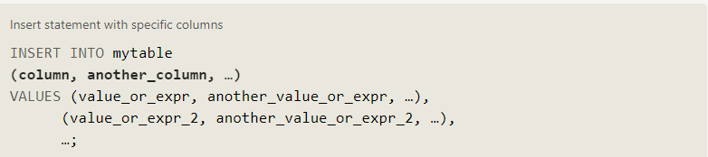
### you can use mathematical and string expressions with the values that you are inserting.

## Updating rows

### a common task is to update existing data, which can be done using an UPDATE statement. Similar to the INSERT statement, you have to specify exactly which table, columns, and rows to update. In addition, the data you are updating has to match the data type of the columns in the table schema.

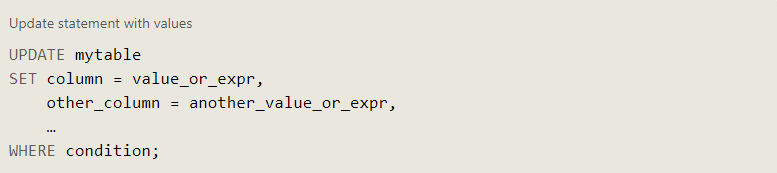

### The statement works by taking multiple column/value pairs, and applying those changes to each and every row that satisfies the constraint in the WHERE clause.

## Taking care

### One helpful tip is to always write the constraint first and test it in a SELECT query to make sure you are updating the right rows, and only then writing the column/value pairs to update.

## Deleting rows

### When you need to delete data from a table in the database, you can use a DELETE statement, which describes the table to act on, and the rows of the table to delete through the WHERE clause.

### If you decide to leave out the WHERE constraint, then all rows are removed, which is a quick and easy way to clear out a table completely

## Creating tables

### When you have new entities and relationships to store in your database, you can create a new database table using the CREATE TABLE statement.

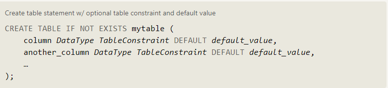

### The structure of the new table is defined by its table schema, which defines a series of columns. Each column has a name, the type of data allowed in that column, an optional table constraint on values being inserted, and an optional default value.
### If there already exists a table with the same name, the SQL implementation will usually throw an error, so to suppress the error and skip creating a table if one exists, you can use the IF NOT EXISTS clause.
