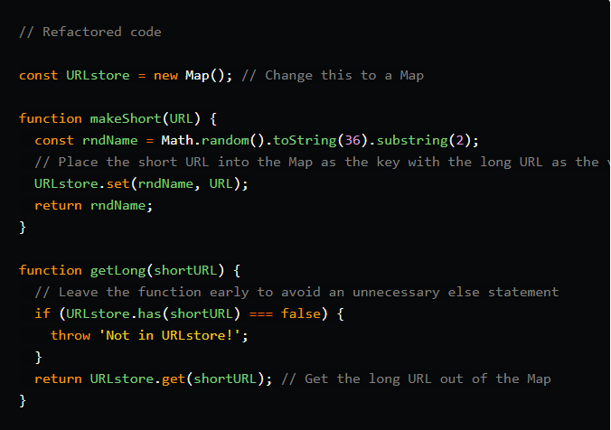
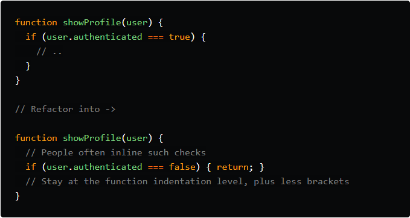
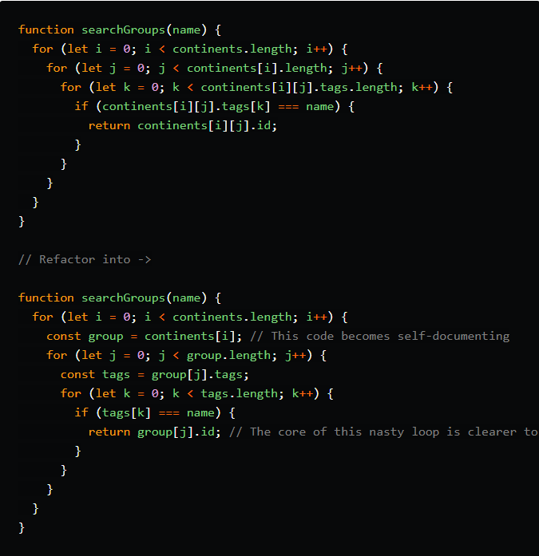
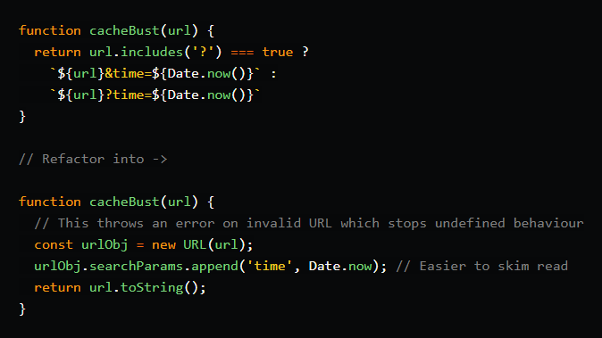

# Refactoring JavaScript for Performance and Readability

### Performance-wise, be careful if you're iterating through a flat array very often, especially if it's a core piece of your program.

## Hash function

### A hash function is used to map a given key to a location in the hash table.

## Strategies

### Here are some straightforward to implement methods that can lead to easier to read code. There are no absolutes when it comes to clean code — there's always an edge case!

## Return early from functions:

## Cache variables so functions can be read like sentences:

## Check for Web APIs before implementing your own functionality:
