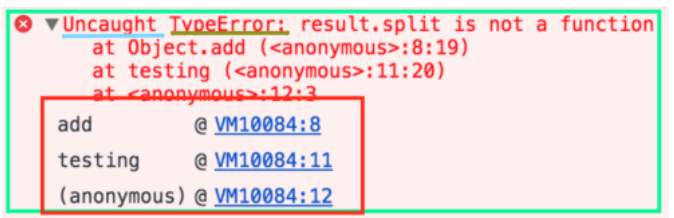
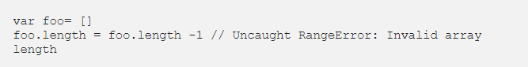

# JavaScript error messages && debugging
## Types of error messages

### The first thing that indicates you that something is wrong with your code is the (in)famous error message that the one we saw just moments ago, it usually appears on your console (being developer tools of the browser, terminal or whatever else you are using).

## *Reference errors*
### This is as simple as when you try to use a variable that is not yet declared you get this type os errors.
### console.log(foo) // Uncaught ReferenceError: foo is not defined

## *Syntax errors*
### This occurs when you have something that cannot be parsed in terms of syntax, like when you try to parse an invalid object using JSON.parse.
### JSON.parse( {'foo': 'bar'} ) // Uncaught SyntaxError: Unexpected token o in JSON at position 1

## *Range errors*

### An array for instance cannot have a negative length, why would you mess with the array length? Some people use it to set an array to empty.

## *Type errors*
### Like the name indicates, this types of errors show up when the types (number, string and so on) you are trying to use or access are incompatible, like accessing a property in an undefined type of variable.

## Debugging

### To debug your JS code, the easiest and maybe the most common way its to simply console.log() the variables you want to check or, by using chrome developer tools, open your page with your JS code (press cmd+o in macOS or Ctrl+o in Windows) and choose your file to debug, click the line you wanna debug and refresh your page again (F5).
### If the line you selected was run you will be able to see what has happened before that point and you can try and evaluate the next lines to check if everything is outputting what you are expecting.
### The breakpoint can also be achieved by putting a debugger statement in your code in the line you want to break.

### You can also add conditional breakpoints by right-clicking a previous set breakpoint, which will make your program stop at that point only if a condition is met, this is awesome for when you want to debug huge cycles for specific values.

## Handling errors
### When we do not handle errors properly, meaning that anything after that error will not be executed. To avoid this we usually try to catch the errors so we can gracefully fallback to a default state of our application in case of an error (this fallback can be a 404 page which is normally not that graceful but is better than a page to just stop working).
### The worthiest outcome of using try…catch tough is the fact that your application will keep on running, maybe with some side effects due to the fact that numberResult now contains an empty array but at least it didn’t just crash onto itself (just make sure the code you have afterwards is bearing in mind the default values of the errors).

## Tools to avoid runtime errors
### JS is not a compiled language like Java so your errors will happen at runtime, that means that you can only see whatever is wrong with your code after your run it.
### Thankfully, to save us quite some time you can use tools like:

- quokka to evaluate your code as you type
- eslint to make sure your style guide is consistency and it will grab you an error or two along the way.