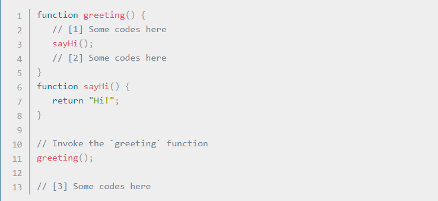

# The *Call Stack* defined on MDN
### A call stack is a mechanism for an interpreter (like the JavaScript interpreter in a web browser) to keep track of its place in a script that calls multiple functions — what function is currently being run and what functions are called from within that function, etc.
- When a script calls a function, the interpreter adds it to the call stack and then starts carrying out the function.
- Any functions that are called by that function are added to the call stack further up, and run where their calls are reached.
- When the current function is finished, the interpreter takes it off the stack and resumes execution where it left off in the last code listing.
- If the stack takes up more space than it had assigned to it, it results in a "stack overflow" error.

## The code above would be executed like this:

1- Ignore all functions, until it reaches the greeting() function invocation.

2- Add the greeting() function to the call stack list.

3- Execute all lines of code inside the greeting() function.

4- Get to the sayHi() function invocation.

5- Add the sayHi() function to the call stack list.

6- Execute all lines of code inside the sayHi() function, until reaches its end.

7- Return execution to the line that invoked sayHi() and continue executing the rest of the greeting() function.

8- Delete the sayHi() function from our call stack list.

9- When everything inside the greeting() function has been executed, return to its invoking line to continue executing the rest of the JS code.

10- Delete the greeting() function from the call stack list.