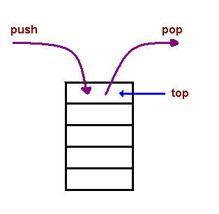
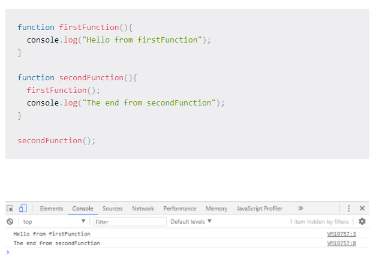

# The JavaScript Call Stack - What It Is and Why It's Necessary
### he call stack is primarily used for function invocation (call). Since the call stack is single, function(s) execution, is done, one at a time, from top to bottom. It means the call stack is synchronous.

## What is the call stack?
### A call stack is a data structure that uses the Last In, First Out (LIFO) principle to temporarily store and manage function invocation (call).

## LIFO 
### It means that the last function that gets pushed into the stack is the first to be pop out, when the function returns.

## Temporarily store
###  When a function is invoked (called), the function, its parameters, and variables are pushed into the call stack to form a stack frame. This stack frame is a memory location in the stack. The memory is cleared when the function returns as it is pop out of the stack.

## Manage function invocation
### The call stack maintains a record of the position of each stack frame. It knows the next function to be executed (and will remove it after execution). This is what makes code execution in JavaScript synchronous.

