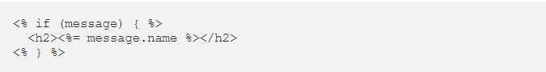
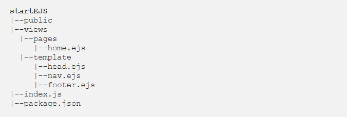
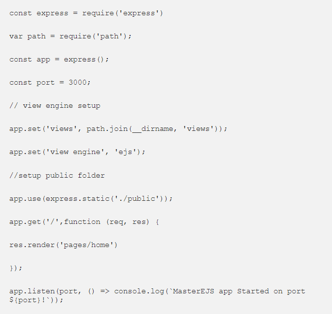
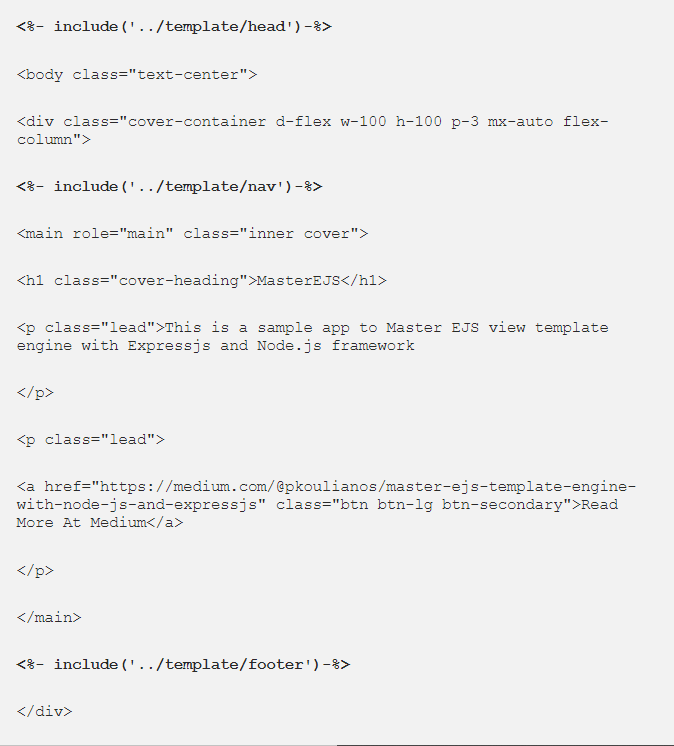
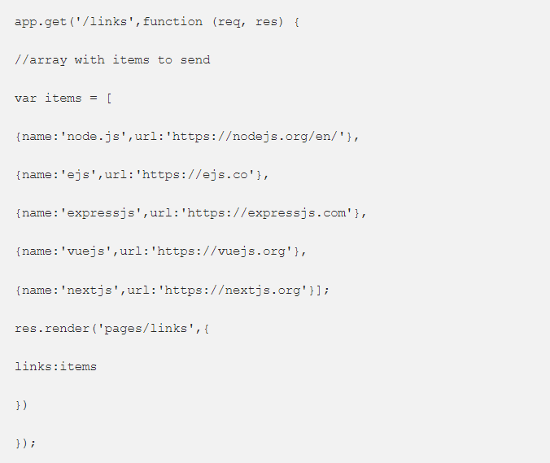
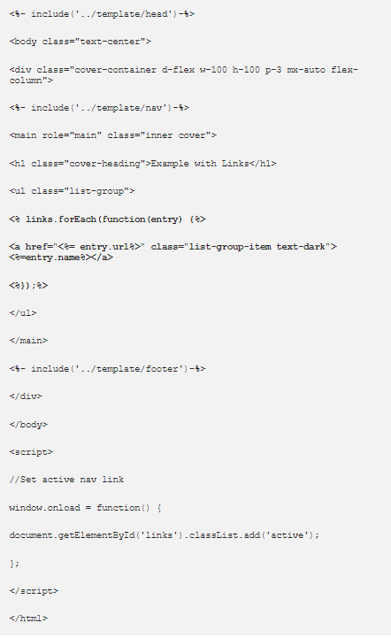
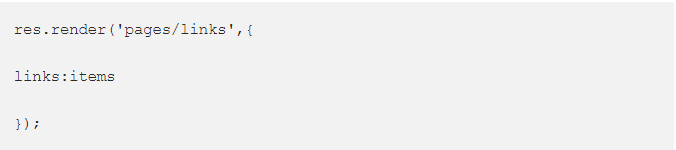
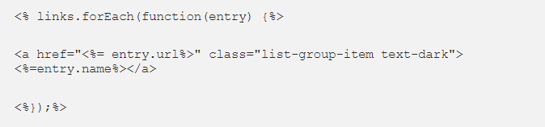

# EJS template engine

# Introduction
### EJS is among the most popular tempate view engines for node.js and expressjs. EJS simply stands for Embedded JavaScript templates, and we can use it both server-side or client-side. At this story.

## Basic Syntax(Tags):
- <% 'Scriptlet' tag, for control-flow, no output.

- <%= Outputs the value into the template (HTML escaped).

- <%- Outputs the unescaped value into the template.

# Partials

### In this section we’ll learn how to use <%- include(‘’)-%> tag.

## Project structure:

## Lets see our index.js file:

## home.ejs

### EJS uses <%- include(‘’)-%> tag to include HTML from other files, in our app, we have the HTML templates at /views/template folder.

# Render Links

## Paste the new router at app.js file with some data to send

## Create a new file with name links.ejs in views/pages folder and paste the following code

## This time at res.render function after the name of the file we want to render we pass a JSON object.

## This JSON object will pass to the view pages/links.ejs. At this point, we use foreach function to iterate the links array and use “<%=” tag to output the properties url and name.

