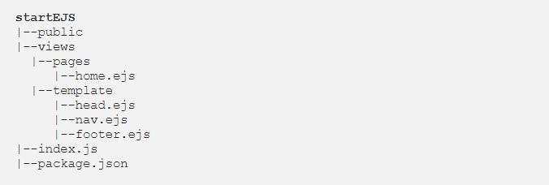

# EJS Partials
## Partials come in handy when you want to reuse the same HTML across multiple views.

## Basic Syntax(Tags):
- <% 'Scriptlet' tag, for control-flow, no output.

- <%= Outputs the value into the template (HTML escaped).

- <%- Outputs the unescaped value into the template.

### In this section we’ll learn how to use <%- include(‘’)-%> tag.

## Project structure:

## Lets see our index.js file:

## home.ejs

### EJS uses <%- include(‘’)-%> tag to include HTML from other files, in our app, we have the HTML templates at /views/template folder.