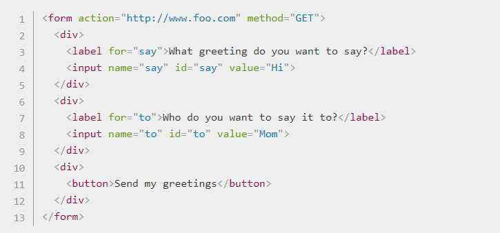
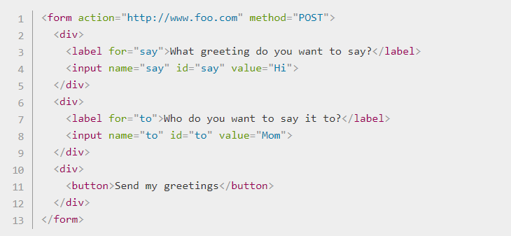
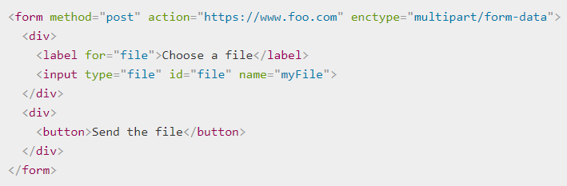

# Sending form data

## Client/server architecture
### At it's most basic, the web uses a client/server architecture that can be summarized as follows. a client (usually a web browser) sends a request to a server, using the HTTP protocol. The server answers the request using the same protocol.

## On the client side: defining how to send the data

### The <form> element defines how the data will be sent. All of its attributes are designed to let you configure the request to be sent when a user hits a submit button. The two most important attributes are action and method.

## The action attribute
### The action attribute defines where the data gets sent. Its value must be a valid relative or absolute URL. If this attribute isn't provided, the data will be sent to the URL of the page containing the form — the current page.

## The method attribute
### The method attribute defines how data is sent. The HTTP protocol provides several ways to perform a request; HTML form data can be transmitted via a number of different methods, the most common being the GET method and the POST method.

## The GET method
### The GET method is the method used by the browser to ask the server to send back a given resource: "Hey server, I want to get this resource." In this case, the browser sends an empty body. Because the body is empty, if a form is sent using this method the data sent to the server is appended to the URL.

### Since the GET method has been used, you'll see the URL www.foo.com/?say=Hi&to=Mom appear in the browser address bar when you submit the form.

### The data is appended to the URL as a series of name/value pairs. After the URL web address has ended, we include a question mark (?) followed by the name/value pairs, each one separated by an ampersand (&). 

## The POST method
### The POST method is a little different. It's the method the browser uses to talk to the server when asking for a response that takes into account the data provided in the body of the HTTP request: "Hey server, take a look at this data and send me back an appropriate result." If a form is sent using this method, the data is appended to the body of the HTTP request.

### When the form is submitted using the POST method, you get no data appended to the URL, and the HTTP request looks like so, with the data included in the request body instead:

## On the server side: retrieving the data
### Whichever HTTP method you choose, the server receives a string that will be parsed in order to get the data as a list of key/value pairs. The way you access this list depends on the development platform you use and on any specific frameworks you may be using with it.
## sending files
### ending files with HTML forms is a special case. Files are binary data — or considered as such — whereas all other data is text data. Because HTTP is a text protocol, there are special requirements for handling binary data.
### If you want to send files, you need to take three extra steps:

- Set the method attribute to POST because file content can't be put inside URL parameters.

- Set the value of enctype to multipart/form-data because the data will be split into multiple parts, one for each file plus one for the text data included in the form body (if text is also entered into the form).

- Include one or more < input type="file"> controls to allow your users to select the file(s) that will be uploaded.

