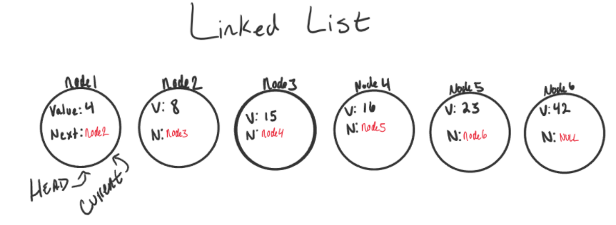

# Table of contents

|Read No. | Name of chapter|
|:---------: |:--------------:|
|5|[Linked List](Linked-Lists.md)

# Linked List

## A Linked List is a sequence of Nodes that are connected/linked to each other. The most defining feature of a Linked List is that each Node references the next Node in the link.

## **Terminology:**
1- **Linked List**- A data structure that contains nodes that links/points to the next node in the list.
2- **Singly** - Singly refers to the number of references the node has. A Singly linked list means that there is only one reference, and the reference points to the Next node in a linked list.
3- **Doubly** - Doubly refers to there being two (double) references within the node. A Doubly linked list means that there is a reference to both the Next and Previous node.
4- **Node** - Nodes are the individual items/links that live in a linked list. Each node contains the data for each link.
5- **Next** - Each node contains a property called Next. This property contains the reference to the next node.
6- **Head** - The Head is a reference type of type Node to the first node in a linked list.
7- **Current** - The Current reference is a reference type of type Node that is currently being looked at. This node is traditionally used when traversing through a full linked list.

## What does it look like

## Traversal
### When traversing a linked list, you are not able to use a foreach or for loop. We depend on the Next value in each node to guide us where the next reference is pointing. The Next property is exceptionally important because it will lead us where the next node is and allow us to extract the data appropriately.
### The best way to approach a traversal is through the use of a while() loop. This allows us to continually check that the Next node in the list is not null. If we accidentally end up trying to traverse on a node that is null, a NullReferenceException gets thrown and our program will crash/end.

### When traversing through a linked list, the Current node is the most helpful. The Current will tell us where exactly in the linked list we are and will allow us to move/traverse forward until we hit the end.

## Big O
### The Big O of time for Includes would be O(n). This is because, at its worse case, the node we are looking for will be the very last node in the linked list. n represents the number of nodes in the linked list.

## Adding a Node

## Adding O(1)

### Order of operations is extremely important when it comes to working with a Linked List. What I mean by this is you must be careful that all references to each link/node is properly assigned.
### An example can be with adding a node to a linked list. If we want to add a node with an O(1) efficiency, we have to replace the current Head of the linked list with the new node, without losing the reference to the next node in the list.
### Here are the required steps to add a new node with an O(1) efficiency.

1- Set Current equal to Head. This will guarantee us that we are starting from the very beginning.
2- We can then instantiate the new node that we are adding. The values passed in as arguments into the Add() method will define what the value of the Node will be.

## Adding a Node O(n)

### Adding a node to the middle of a linked list is a bit different than adding to the beginning. This is because we are working with more nodes and must re-allocate to make room for the new node.

1- Let's start out with a basic Singly Linked List:

2- Now let's create a new node (node6). We will set the value of node6 to be 16. The Next will be null because we haven't yet attached it into the linked list.

3- Now let's start the adding. We can do an AddBefore method or an AddAfter.

### We already learned how to traverse earlier, and that is exactly what we want to do now. We will traverse while the next node is not null. Before moving Current to the next node, we want check if the value of the next node is equal to the value we are supposed to be watching for (the value of the existing node we are inserting before). If it is, we want to set the new node (node6)'s .Next equal to the existing node