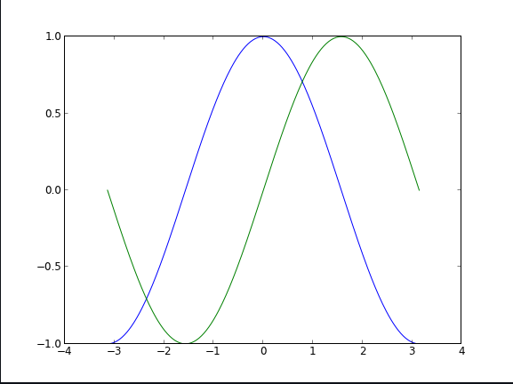

# Table of contents

|Read No. | Name of chapter|
|:---------: |:--------------:|
|14|[Matplotlib Tutorial](Matplotlib-Tutorial.md)


# Matplotlib Tutorial

## Introduction
### matplotlib is probably the single most used Python package for 2D-graphics. It provides both a very quick way to visualize data from Python and publication-quality figures in many formats.
## pyplot

### pyplot provides a convenient interface to the matplotlib object-oriented plotting library. It is modeled closely after Matlab(TM). Therefore, the majority of plotting commands in pyplot have Matlab(TM) analogs with similar arguments. Important commands are explained with interactive examples.

## Simple plot
### n this section, we want to draw the cosine and sine functions on the same plot. Starting from the default settings

### The first step is to get the data for the sine and cosine functions:
```python
import numpy as np

X = np.linspace(-np.pi, np.pi, 256, endpoint=True)
C, S = np.cos(X), np.sin(X)
plt.plot(X,C)
plt.plot(X,S)

plt.show()
```



### X is now a NumPy array with 256 values ranging from -π to +π (included). C is the cosine (256 values) and S is the sine (256 values).

## Using defaults

### Matplotlib comes with a set of default settings that allow customizing all kinds of properties. You can control the defaults of almost every property in matplotlib: figure size and dpi, line width, color and style, axes, axis and grid properties, text and font properties and so on. While matplotlib defaults are rather good in most cases, you may want to modify some properties for specific cases.

## Changing colors and line widths

```python
plt.figure(figsize=(10,6), dpi=80)
plt.plot(X, C, color="blue", linewidth=2.5, linestyle="-")
plt.plot(X, S, color="red",  linewidth=2.5, linestyle="-")
```

## Setting limits

```python
plt.xlim(X.min()*1.1, X.max()*1.1)
plt.ylim(C.min()*1.1, C.max()*1.1)
```

## Annotate some points

### Let's annotate some interesting points using the annotate command. We choose the 2π/3 value and we want to annotate both the sine and the cosine. We'll first draw a marker on the curve as well as a straight dotted line. Then, we'll use the annotate command to display some text with an arrow.
```python
t = 2*np.pi/3
plt.plot([t,t],[0,np.cos(t)], color ='blue', linewidth=1.5, linestyle="--")
plt.scatter([t,],[np.cos(t),], 50, color ='blue')

plt.annotate(r'$\sin(\frac{2\pi}{3})=\frac{\sqrt{3}}{2}$',
             xy=(t, np.sin(t)), xycoords='data',
             xytext=(+10, +30), textcoords='offset points', fontsize=16,
             arrowprops=dict(arrowstyle="->", connectionstyle="arc3,rad=.2"))

plt.plot([t,t],[0,np.sin(t)], color ='red', linewidth=1.5, linestyle="--")
plt.scatter([t,],[np.sin(t),], 50, color ='red')

plt.annotate(r'$\cos(\frac{2\pi}{3})=-\frac{1}{2}$',
             xy=(t, np.cos(t)), xycoords='data',
             xytext=(-90, -50), textcoords='offset points', fontsize=16,
             arrowprops=dict(arrowstyle="->", connectionstyle="arc3,rad=.2"))
```

## Figures, Subplots and Axes 

### **Figures**
### A figure is the windows in the GUI that has "Figure #" as title. Figures are numbered starting from 1 as opposed to the normal Python way starting from 0. This is clearly MATLAB-style. There are several parameters that determine what the figure looks like:

|Argument | Default|Description|
|:---------: |:--------------:|:--------------:|
|num|	1	|number of figure|
|figsize|	figure.figsize|	figure size in in inches (width, height)|
|dpi|	figure.dpi|	resolution in dots per inch|
|facecolor|	figure.facecolor|	color of the drawing background|
|edgecolor|	figure.edgecolor|	color of edge around the drawing background|
|frameon|	True|	draw figure frame or not|


### When you work with the GUI you can close a figure by clicking on the x in the upper right corner. You can also close a figure programmatically by calling close.

### **Subplots**

### With subplot you can arrange plots in a regular grid. You need to specify the number of rows and columns and the number of the plot.

### **Axes**
### Axes are very similar to subplots but allow placement of plots at any location in the figure. So if we want to put a smaller plot inside a bigger one we do so with axes.


## Animation

### For quite a long time, animation in matplotlib was not an easy task and was done mainly through clever hacks. However, things have started to change since version 1.1 and the introduction of tools for creating animation very intuitively, with the possibility to save them in all kind of formats (but don't expect to be able to run very complex animations at 60 fps though).

### The most easy way to make an animation in matplotlib is to declare a FuncAnimation object that specifies to matplotlib what is the figure to update, what is the update function and what is the delay between frames.

### **Drip drop**
### A very simple rain effect can be obtained by having small growing rings randomly positioned over a figure. Of course, they won't grow forever since the wave is supposed to damp with time. To simulate that, we can use a more and more transparent color as the ring is growing, up to the point where it is no more visible. At this point, we remove the ring and create a new one.

### First step is to create a blank figure:

```python
# New figure with white background
fig = plt.figure(figsize=(6,6), facecolor='white')

# New axis over the whole figure, no frame and a 1:1 aspect ratio
ax = fig.add_axes([0,0,1,1], frameon=False, aspect=1)
```

### Next, we need to create several rings. For this, we can use the scatter plot object that is generally used to visualize points cloud, but we can also use it to draw rings by specifying we don't have a facecolor. We also have to take care of initial size and color for each ring such that we have all sizes between a minimum and a maximum size. In addition, we need to make sure the largest ring is almost transparent.
```python
# Number of ring
n = 50
size_min = 50
size_max = 50*50

# Ring position
P = np.random.uniform(0,1,(n,2))

# Ring colors
C = np.ones((n,4)) * (0,0,0,1)
# Alpha color channel goes from 0 (transparent) to 1 (opaque)
C[:,3] = np.linspace(0,1,n)

# Ring sizes
S = np.linspace(size_min, size_max, n)

# Scatter plot
scat = ax.scatter(P[:,0], P[:,1], s=S, lw = 0.5,
                  edgecolors = C, facecolors='None')

# Ensure limits are [0,1] and remove ticks
ax.set_xlim(0,1), ax.set_xticks([])
ax.set_ylim(0,1), ax.set_yticks([])

```

### Now, we need to write the update function for our animation. We know that at each time step each ring should grow and become more transparent while the largest ring should be totally transparent and thus removed. Of course, we won't actually remove the largest ring but re-use it to set a new ring at a new random position, with nominal size and color. Hence, we keep the number of rings constant.
```python
def update(frame):
    global P, C, S

    # Every ring is made more transparent
    C[:,3] = np.maximum(0, C[:,3] - 1.0/n)

    # Each ring is made larger
    S += (size_max - size_min) / n

    # Reset ring specific ring (relative to frame number)
    i = frame % 50
    P[i] = np.random.uniform(0,1,2)
    S[i] = size_min
    C[i,3] = 1

    # Update scatter object
    scat.set_edgecolors(C)
    scat.set_sizes(S)
    scat.set_offsets(P)

    # Return the modified object
    return scat,

```

### Last step is to tell matplotlib to use this function as an update function for the animation and display the result or save it as a movie:

```python
animation = FuncAnimation(fig, update, interval=10, blit=True, frames=200)
# animation.save('rain.gif', writer='imagemagick', fps=30, dpi=40)
plt.show()
```


