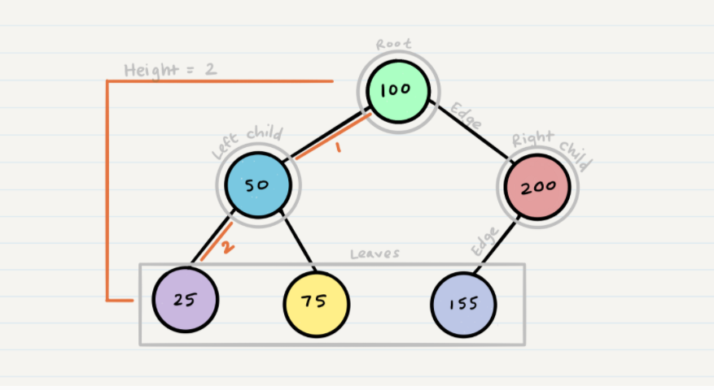
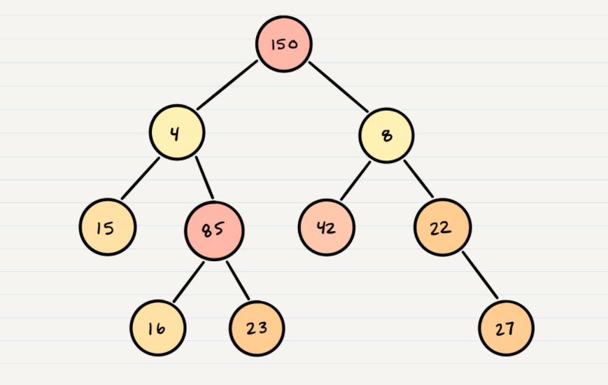

# Table of contents

|Read No. | Name of chapter|
|:---------: |:--------------:|
|14|[Trees](Trees.md)


# Trees

## Common Terminology
- Node - A node is the individual item/data that makes up the data structure
- Root - The root is the first/top Node in the tree
- Left Child - The node that is positioned to the left of a root or node
- Right Child - The node that is positioned to the right of a root or node
- Edge - The edge in a tree is the link between a parent and child node
- Leaf - A leaf is a node that does not contain any children
- Height - The height of a tree is determined by the number of edges from the root to the bottommost node



## Traversals

### An important aspect of trees is how to traverse them. Traversing a tree allows us to search for a node, print out the contents of a tree, and much more! There are two categories of traversals when it comes to trees:

- Depth First
- Breadth First

## Depth First

### Depth first traversal is where we prioritize going through the depth (height) of the tree first. There are multiple ways to carry out depth first traversal, and each method changes the order in which we search/print the root. Here are three methods for depth first traversal:

- Pre-order: root >> left >> right
- In-order: left >> root >> right
- Post-order: left >> right >> root

### The most common way to traverse through a tree is to use recursion. With these traversals, we rely on the call stack to navigate back up the tree when we have reached the end of a sub-path.

### **Pre-order**

```
ALGORITHM preOrder(root)

  OUTPUT <-- root.value

  if root.left is not NULL
      preOrder(root.left)

  if root.right is not NULL
      preOrder(root.right)
```

### **In-order**

```
ALGORITHM preOrder(root)

  
  if root.left is not NULL
      preOrder(root.left)

  OUTPUT <-- root.value

  if root.right is not NULL
      preOrder(root.right)
```

### **Post-order**

```
ALGORITHM preOrder(root)

  
  if root.left is not NULL
      preOrder(root.left)

 
  if root.right is not NULL
      preOrder(root.right)

   OUTPUT <-- root.value
```

## Breadth First

### Breadth first traversal iterates through the tree by going through each level of the tree node-by-node.
### Traditionally, breadth first traversal uses a queue (instead of the call stack via recursion) to traverse the width/breadth of the tree.
```
ALGORITHM breadthFirst(root)
// INPUT  <-- root node
// OUTPUT <-- front node of queue to console

  Queue breadth <-- new Queue()
  breadth.enqueue(root)

  while breadth.peek()
    node front = breadth.dequeue()
    OUTPUT <-- front.value

    if front.left is not NULL
      breadth.enqueue(front.left)

    if front.right is not NULL
      breadth.enqueue(front.right)
```

## Binary Trees

### Trees can have any number of children per node, but Binary Trees restrict the number of children to two (hence our left and right children).

### There is no specific sorting order for a binary tree. Nodes can be added into a binary tree wherever space allows. Here is what a binary tree looks like:



## Adding a node

### Because there are no structural rules for where nodes are “supposed to go” in a binary tree, it really doesn’t matter where a new node gets placed.

### One strategy for adding a new node to a binary tree is to fill all “child” spots from the top down. To do so, we would leverage the use of breadth first traversal. During the traversal, we find the first node that does not have 2 child nodes, and insert the new node as a child. We fill the child slots from left to right.

### In the event you would like to have a node placed in a specific location, you need to reference both the new node to create, and the parent node upon which the child is attached to.

## Big O

### The Big O time complexity for inserting a new node is O(n). Searching for a specific node will also be O(n). Because of the lack of organizational structure in a Binary Tree, the worst case for most operations will involve traversing the entire tree. If we assume that a tree has n nodes, then in the worst case we will have to look at n items, hence the O(n) complexity.

### The Big O space complexity for a node insertion using breadth first insertion will be O(w), where w is the largest width of the tree. For example, in the above tree, w is 4.

### A “perfect” binary tree is one where every non-leaf node has exactly two children. The maximum width for a perfect binary tree, is 2^(h-1), where h is the height of the tree. Height can be calculated as log n, where n is the number of nodes.

## Binary Search Trees
### A Binary Search Tree (BST) is a type of tree that does have some structure attached to it. In a BST, nodes are organized in a manner where all values that are smaller than the root are placed to the left, and all values that are larger than the root are placed to the right.

## Searching a BST

### Searching a BST can be done quickly, because all you do is compare the node you are searching for against the root of the tree or sub-tree. If the value is smaller, you only traverse the left side. If the value is larger, you only traverse the right side.

## Big O
### The Big O time complexity of a Binary Search Tree’s insertion and search operations is O(h), or O(height). In the worst case, we will have to search all the way down to a leaf, which will require searching through as many nodes as the tree is tall. In a balanced (or “perfect”) tree, the height of the tree is log(n). In an unbalanced tree, the worst case height of the tree is n.

### The Big O space complexity of a BST search would be O(1). During a search, we are not allocating any additional space.