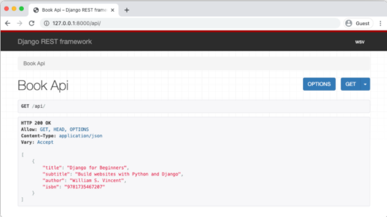

# Django for APIs - Library Website
### The most important takeaway is that Django creates websites containing webpages, while Django REST Framework creates web APIs which are a collection of URL endpoints containing available HTTP verbs that return JSON.
### To illustrate these concepts, we will build out a basic Library website with traditional Django and then extend it into a web API with Django REST Framework.
## Traditional Django
### you can read this [Getting Started with Django](../read20/Readme.md)

## Django REST Framework
### Django REST Framework is added just like any other third-party app. On the command line type the below.

```
(library) $ pipenv install djangorestframework~=3.11.0
```
### Or if you are poetry user use this command:
```
(.venv) $ poetry add djangorestframework
```
### Add it to the INSTALLED_APPS config in our settings.py file. I like to make a distinction between third-party apps and local apps as follows since the number of apps grows quickly in most projects.
```python
# config/settings.py
INSTALLED_APPS = [
    'django.contrib.admin',
    'django.contrib.auth',
    'django.contrib.contenttypes',
    'django.contrib.sessions',
    'django.contrib.messages',
    'django.contrib.staticfiles',

    # 3rd party
    'rest_framework', # new

    # Local
    'books',
]
```
### Ultimately, our API will expose a single endpoint that lists out all books in JSON. So we will need a new URL route, a new view, and a new serializer file (more on this shortly).
### There are multiple ways we can organize these files however my preferred approach is to create a dedicated api app. That way even if we add more apps in the future, each app can contain the models, views, templates, and urls needed for dedicated webpages, but all API-specific files for the entire project will live in a dedicated api app.

### Let’s first create a new api app.
```
(library) $ python manage.py startapp api
```
### Then add it to INSTALLED_APPS.
```python
# config/settings.py
INSTALLED_APPS = [
    'django.contrib.admin',
    'django.contrib.auth',
    'django.contrib.contenttypes',
    'django.contrib.sessions',
    'django.contrib.messages',
    'django.contrib.staticfiles',

    # 3rd party
    'rest_framework',

    # Local
    'books',
    'api', # new
]
```
### The api app will not have its own database models so there is no need to create a migration file and run migrate to update the database.
## URLs
### Let’s start with our URL configs. Adding an API endpoint is just like configuring a traditional Django app’s routes. First at the project-level we need to include the api app and configure its URL route, which will be api/.
```python
# config/urls.py
from django.contrib import admin
from django.urls import path, include

urlpatterns = [
    path('admin/', admin.site.urls),
    path('api/', include('api.urls')), # new
    path('', include('books.urls')),
]
```
### Then create a urls.py file within the api app.
```
(library) $ touch api/urls.py
```
### And update it as follows:
```python
# api/urls.py
from django.urls import path
from .views import BookAPIView

urlpatterns = [
    path('', BookAPIView.as_view()),
]
```
## Views
### Next up is our views.py file which relies on Django REST Framework’s built-in generic class views. These deliberately mimic traditional Django’s generic class-based views in format, but they are not the same thing.

### To avoid confusion, some developers will call an API views file apiviews.py or api.py. Personally, when working within a dedicated api app I do not find it confusing to just call a Django REST Framework views file views.py but opinion varies on this point.

### Within our views.py file, update it to look like the following:
```python
# api/views.py
from rest_framework import generics

from books.models import Book
from .serializers import BookSerializer


class BookAPIView(generics.ListAPIView):
    queryset = Book.objects.all()
    serializer_class = BookSerializer

```
### On the top lines we import Django REST Framework’s generics class of views, the models from our books app, and serializers from our api app (we will make the serializers next).

### Then we create a BookAPIView that uses ListAPIView to create a read-only endpoint for all book instances. 

### The only two steps required in our view are to specify the queryset which is all available books, and then the serializer_class which will be BookSerializer.

## A serializer translates data into a format that is easy to consume over the internet, typically JSON, and is displayed at an API endpoint. For now I want to demonstrate how easy it is to create a serializer with Django REST Framework to convert Django models to JSON.

### Make a serializers.py file within our api app.
```
(library) $ touch api/serializers.py
```
### Then update it as follows in a text editor.
```python
# api/serializers.py
from rest_framework import serializers

from books.models import Book


class BookSerializer(serializers.ModelSerializer):
    class Meta:
        model = Book
        fields = ('title', 'subtitle', 'author', 'isbn')

```
### On the top lines we import Django REST Framework’s serializers class and the Book model from our books app. We extend Django REST Framework’s ModelSerializer into a BookSerializer class that specifies our database model Book and the database fields we wish to expose: title, subtitle, author, and isbn.

## cURL
### We want to see what our API endpoint looks like. We know it should return JSON at the URL http://127.0.0.1:8000/api/. Let’s ensure that our local Django server is running:
```
(library) $ python manage.py runserver
```
### Now open a new, second command line console. We will use it to access the API running in the existing command line console.

### We can use the popular cURL program to execute HTTP requests via the command line. All we need for a basic GET request it to specify curl and the URL we want to call.
```
$ curl http://127.0.0.1:8000/api/
[  
   {  
      "title":"Django for Beginners",
      "subtitle":"Build websites with Python and Django",
      "author":"William S. Vincent",
      "isbn":"978-198317266"
   }
]
```
### The data is all there, in JSON format, but it is poorly formatted and hard to make sense of. Fortunately Django REST Framework has a further surprise for us: a powerful visual mode for our API endpoints.

## Browsable API
### With the local server still running in the first command line console, navigate to our API endpoint in the web browser at http://127.0.0.1:8000/api/.
