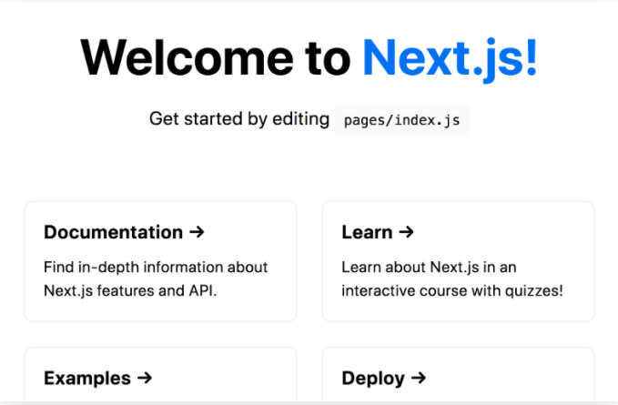

# Table of contents
|Read No. | Name of chapter|
|:---------: |:--------------:|
|33|[NextJs](NextJs.md)


# NextJs
## Create a Next.js app
### To create a Next.js app, open your terminal, cd into the directory you’d like to create the app in, and run the following command:
```
npx create-next-app nextjs-blog --use-npm --example "https://github.com/vercel/next-learn-starter/tree/master/learn-starter"
```
### Under the hood, this uses the tool called create-next-app, which bootstraps a Next.js app for you. It uses this template through the --example flag.


### Run the development server
### You now have a new directory called nextjs-blog. Let’s cd into it:
```
cd nextjs-blog
```
### Then, run the following command:
```
npm run dev
```
### This starts your Next.js app’s "development server" (more on this later) on port 3000.

### Let’s check to see if it’s working. Open http://localhost:3000 from your browser.

## Welcome to Next.js
### You should see a page like this when you access http://localhost:3000. This is the starter template page which shows some helpful information about Next.js.


## Editing the Page
### Let’s try editing the starter page.

- Make sure the Next.js development server is still running.
- Open pages/index.js with your text editor.
- Find the text that says “Welcome to” under the < h1> tag and change it to “Learn”.
- Save the file.
- As soon as you save the file, the browser automatically updates the page with the new text

## Create a New Page
### Create the posts directory under pages.

### Create a file called first-post.js inside the posts directory with the following content:
```js
export default function FirstPost() {
  return <h1>First Post</h1>
}
```
### The component can have any name, but you must export it as a default export.
### Now, make sure that the development server is running and visit http://localhost:3000/posts/first-post. You should see the page.
## Link Component
### When linking between pages on websites, you use the < a> HTML tag.

### In Next.js, you use the Link Component from next/link to wrap the < a> tag. < Link> allows you to do client-side navigation to a different page in the application.
## Using < Link>
### First, open pages/index.js, and import the Link component from next/link by adding this line at the top:
```js
import Link from 'next/link'
```
### Then find the h1 tag that looks like this:
```js
<h1 className="title">
  Learn <a href="https://nextjs.org">Next.js!</a>
</h1>
```
### And change it to:
```js
<h1 className="title">
  Read{' '}
  <Link href="/posts/first-post">
    <a>this page!</a>
  </Link>
</h1>
```
### {' '} adds an empty space, which is used to divide text over multiple lines.

### Next, open pages/posts/first-post.js and replace its content with the following:
```js
import Link from 'next/link'

export default function FirstPost() {
  return (
    <>
      <h1>First Post</h1>
      <h2>
        <Link href="/">
          <a>Back to home</a>
        </Link>
      </h2>
    </>
  )
}
```
### As you can see, the Link component is similar to using < a> tags, but instead of < a href="…">, you use < Link href="…"> and put an < a> tag inside.

## Code splitting and prefetching
### Next.js does code splitting automatically, so each page only loads what’s necessary for that page. That means when the homepage is rendered, the code for other pages is not served initially.

### This ensures that the homepage loads quickly even if you have hundreds of pages.

### Only loading the code for the page you request also means that pages become isolated. If a certain page throws an error, the rest of the application would still work.

### Furthermore, in a production build of Next.js, whenever Link components appear in the browser’s viewport, Next.js automatically prefetches the code for the linked page in the background. By the time you click the link, the code for the destination page will already be loaded in the background, and the page transition will be near-instant!

### **Note:** If you need to link to an external page outside the Next.js app, just use an < a> tag without Link.

### If you need to add attributes like, for example, className, add it to the a tag, not to the Link tag.

## Assets
### First, let’s talk about how Next.js handles static assets such as images.

### Next.js can serve static files, like images, under the top-level public directory. Files inside public can be referenced from the root of the application similar to pages.

### If you open pages/index.js in your application and take a look at the < footer>, we refer to the logo image like so:
```js
< img src="/vercel.svg" alt="Vercel Logo" className="logo" />
```
### The logo image exists inside the public directory at the top level of your application.
## Metadata
### What if we wanted to modify the metadata of the page, such as the < title> HTML tag?

### < title> is part of the < head> HTML tag, so let's dive into how we can modify the < head> tag in a Next.js page.

### Open pages/index.js in your editor and find the following lines:
```js
<Head>
  <title>Create Next App</title>
  <link rel="icon" href="/favicon.ico" />
</Head>
```
### Notice that < Head> is used instead of the lowercase < head>. < Head> is a React Component that is built into Next.js. It allows you to modify the < head> of a page.

### You can import the Head component from the next/head module.

### Adding Head to first-post.js
### We haven't added a < title> to our /posts/first-post route. Let's add one.

### Open the pages/posts/first-post.js file and add an import for Head from next/head at the beginning of the file:
```js
import Head from 'next/head'
```
### Then, update the exported FirstPost component to include the Head component. For now, we‘ll add just the title tag:
```js
export default function FirstPost() {
  return (
    <>
      <Head>
        <title>First Post</title>
      </Head>
      <h1>First Post</h1>
      <h2>
        <Link href="/">
          <a>Back to home</a>
        </Link>
      </h2>
    </>
  )
}
```
### Try accessing http://localhost:3000/posts/first-post. The browser tab should now say “First Post”. By using your browser’s developer tools, you should see that the title tag is added to < head>.

## CSS Styling
### Let’s now talk about CSS styling.

### As you can see, our index page (http://localhost:3000) already has some styles. If you take a look at pages/index.js, you should see code like this:
```js
<style jsx>{`
  …
`}</style>
```
### This page is using a library called styled-jsx. It’s a “CSS-in-JS” library — it lets you write CSS within a React component, and the CSS styles will be scoped (other components won’t be affected).

## Layout Component
### First, Let’s create a Layout component which will be shared across all pages.

### Create a top-level directory called components.
### Inside components, create a file called layout.js with the following content:
```js
export default function Layout({ children }) {
  return <div>{children}</div>
}
```
### Then, open pages/posts/first-post.js, add an import for the Layout component, and make it the outermost component:
```js
import Head from 'next/head'
import Link from 'next/link'
import Layout from '../../components/layout'

export default function FirstPost() {
  return (
    <Layout>
      <Head>
        <title>First Post</title>
      </Head>
      <h1>First Post</h1>
      <h2>
        <Link href="/">
          <a>Back to home</a>
        </Link>
      </h2>
    </Layout>
  )
}
```
## Adding CSS
### Now, let’s add some styles to the Layout component. To do so, we’ll use CSS Modules, which lets you import CSS files in a React component.

### Create a file called components/layout.module.css with the following content:
```css
.container {
  max-width: 36rem;
  padding: 0 1rem;
  margin: 3rem auto 6rem;
}
```
### **Important:** To use CSS Modules, the CSS file name must end with .module.css.

### To use this container class inside components/layout.js, you need to:

### Import the CSS file and assign a name to it, like styles
### Use styles.container as the className
### Open components/layout.js and replace its content with the following:
```js
import styles from './layout.module.css'

export default function Layout({ children }) {
  return <div className={styles.container}>{children}</div>
}
```
### If you go to http://localhost:3000/posts/first-post now, you should see that the text is now inside a centered container.
## Global Styles
### CSS Modules are useful for component-level styles. But if you want some CSS to be loaded by every page, Next.js has support for that as well.

### To load global CSS files, create a file called pages/_app.js with the following content:
```js
export default function App({ Component, pageProps }) {
  return <Component {...pageProps} />
}
```
### This App component is the top-level component which will be common across all the different pages. You can use this App component to keep state when navigating between pages, for example.

### Restart the Development Server
### **Important:** You need to restart the development server when you add pages/_app.js. Press Ctrl + c to stop the server and run:
```
npm run dev
```

## Adding Global CSS
### In Next.js, you can add global CSS files by importing them from pages/_app.js. You cannot import global CSS anywhere else.

### The reason that global CSS can't be imported outside of pages/_app.js is that global CSS affects all elements on the page.

### If you were to navigate from the homepage to the /posts/first-post page, global styles from the homepage would affect /posts/first-post unintentionally.

### You can place the global CSS file anywhere and use any name. So let’s do the following:

- Create a top-level styles directory and create global.css inside.
- Add the following content to styles/global.css. It resets some styles and changes the color of the a tag:
```css
html,
body {
  padding: 0;
  margin: 0;
  font-family: -apple-system, BlinkMacSystemFont, Segoe UI, Roboto, Oxygen, Ubuntu,
    Cantarell, Fira Sans, Droid Sans, Helvetica Neue, sans-serif;
  line-height: 1.6;
  font-size: 18px;
}

* {
  box-sizing: border-box;
}

a {
  color: #0070f3;
  text-decoration: none;
}

a:hover {
  text-decoration: underline;
}

img {
  max-width: 100%;
  display: block;
}
```
### Finally, open pages/_app.js add import the CSS file like so:
```js
import '../styles/global.css'

export default function App({ Component, pageProps }) {
  return <Component {...pageProps} />
}
```
## Polishing Layout
### So far, we’ve only added minimal React and CSS code just to illustrate concepts such as CSS Modules. Before we move on to our next lesson about data fetching, let’s polish our page styling and code.

### Download Your Profile Picture
### First, we’ll be using your profile picture for the final design.

- Download your profile picture in .jpg format.
- Create an images directory inside of the public directory.
- Save the picture as profile.jpg in the public/images directory.
- The image size can be around 400px by 400px.
- You may remove the unused SVG logo file directly under the public directory.
## Update components/layout.module.css
### Second, open components/layout.module.css and replace its content with the following more polished styles for the layout and profile picture:
```css
.container {
  max-width: 36rem;
  padding: 0 1rem;
  margin: 3rem auto 6rem;
}

.header {
  display: flex;
  flex-direction: column;
  align-items: center;
}

.headerImage {
  width: 6rem;
  height: 6rem;
}

.headerHomeImage {
  width: 8rem;
  height: 8rem;
}

.backToHome {
  margin: 3rem 0 0;
}
```
## Create styles/utils.module.css
### Third, let’s create a set of utility CSS classes for typography and others that will be useful across multiple components.

### Let’s add a new CSS file called styles/utils.module.css with the following content:
```css
.heading2Xl {
  font-size: 2.5rem;
  line-height: 1.2;
  font-weight: 800;
  letter-spacing: -0.05rem;
  margin: 1rem 0;
}

.headingXl {
  font-size: 2rem;
  line-height: 1.3;
  font-weight: 800;
  letter-spacing: -0.05rem;
  margin: 1rem 0;
}

.headingLg {
  font-size: 1.5rem;
  line-height: 1.4;
  margin: 1rem 0;
}

.headingMd {
  font-size: 1.2rem;
  line-height: 1.5;
}

.borderCircle {
  border-radius: 9999px;
}

.colorInherit {
  color: inherit;
}

.padding1px {
  padding-top: 1px;
}

.list {
  list-style: none;
  padding: 0;
  margin: 0;
}

.listItem {
  margin: 0 0 1.25rem;
}

.lightText {
  color: #999;
}
```
## Update components/layout.js
### Fourth, open components/layout.js and replace its content with the following code, change Your Name at the top to your name:
```js
import Head from 'next/head'
import styles from './layout.module.css'
import utilStyles from '../styles/utils.module.css'
import Link from 'next/link'

const name = 'Your Name'
export const siteTitle = 'Next.js Sample Website'

export default function Layout({ children, home }) {
  return (
    <div className={styles.container}>
      <Head>
        <link rel="icon" href="/favicon.ico" />
        <meta
          name="description"
          content="Learn how to build a personal website using Next.js"
        />
        <meta
          property="og:image"
          content={`https://og-image.now.sh/${encodeURI(
            siteTitle
          )}.png?theme=light&md=0&fontSize=75px&images=https%3A%2F%2Fassets.vercel.com%2Fimage%2Fupload%2Ffront%2Fassets%2Fdesign%2Fnextjs-black-logo.svg`}
        />
        <meta name="og:title" content={siteTitle} />
        <meta name="twitter:card" content="summary_large_image" />
      </Head>
      <header className={styles.header}>
        {home ? (
          <>
            
            <h1 className={utilStyles.heading2Xl}>{name}</h1>
          </>
        ) : (
          <>
            <Link href="/">
              <a>
                
              </a>
            </Link>
            <h2 className={utilStyles.headingLg}>
              <Link href="/">
                <a className={utilStyles.colorInherit}>{name}</a>
              </Link>
            </h2>
          </>
        )}
      </header>
      <main>{children}</main>
      {!home && (
        <div className={styles.backToHome}>
          <Link href="/">
            <a>← Back to home</a>
          </Link>
        </div>
      )}
    </div>
  )
}
```
### Here’s what’s new:

- meta tags (like og:image), which are used to describe a page's content
- Boolean home prop which will adjust the size of the title and the image
- “Back to home” link at the bottom if home is false
## Update pages/index.js
### Finally, let's update the homepage.

### Open pages/index.js and replace its content with:
```js
import Head from 'next/head'
import Layout, { siteTitle } from '../components/layout'
import utilStyles from '../styles/utils.module.css'

export default function Home() {
  return (
    <Layout home>
      <Head>
        <title>{siteTitle}</title>
      </Head>
      <section className={utilStyles.headingMd}>
        <p>[Your Self Introduction]</p>
        <p>
          (This is a sample website - you’ll be building a site like this on{' '}
          <a href="https://nextjs.org/learn">our Next.js tutorial</a>.)
        </p>
      </section>
    </Layout>
  )
}
```
Then replace [Your Self Introduction] with your self introduction.