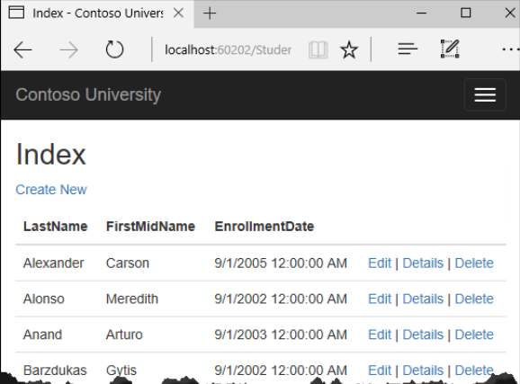
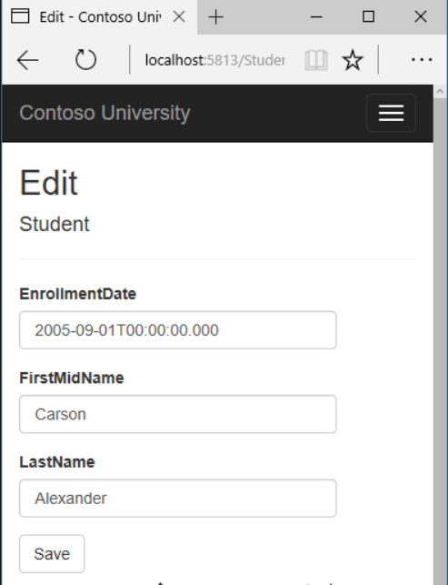
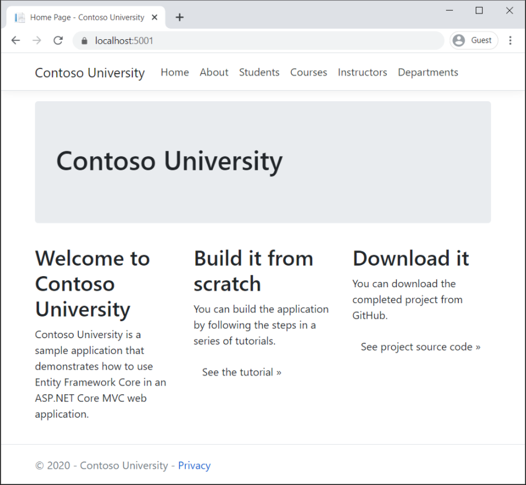
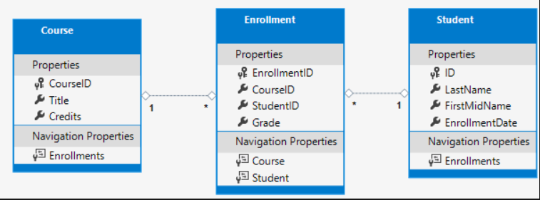

# Get started with EF Core in an ASP.NET MVC web app

## Database engines
The Visual Studio instructions use SQL Server LocalDB, a version of SQL Server Express that runs only on Windows.

## Contoso University web app
The app built in these tutorials is a basic university web site.

Users can view and update student, course, and instructor information. Here are a few of the screens in the app:




## Create web app
1. Start Visual Studio and select Create a new project.
2. In the Create a new project dialog, select ASP.NET Core Web Application > Next.
3. In the Configure your new project dialog, enter ContosoUniversity for Project name. It's important to use this exact name including capitalization, so each namespace matches when code is copied.
4. Select Create.
5. In the Create a new ASP.NET Core web application dialog, select:
    - .NET Core and ASP.NET Core 5.0 in the dropdowns.
    - ASP.NET Core Web App (Model-View-Controller).
    - Create


## Set up the site style

A few basic changes set up the site menu, layout, and home page.

Open Views/Shared/_Layout.cshtml and make the following changes:

- Change each occurrence of ContosoUniversity to Contoso University. There are three occurrences.
- Add menu entries for About, Students, Courses, Instructors, and Departments, and delete the Privacy menu entry.
The preceding changes are highlighted in the following code:
```csharp
<!DOCTYPE html>
<html lang="en">
<head>
    <meta charset="utf-8" />
    <meta name="viewport" content="width=device-width, initial-scale=1.0" />
    <title>@ViewData["Title"] - Contoso University</title>
    <link rel="stylesheet" href="~/lib/bootstrap/dist/css/bootstrap.min.css" />
    <link rel="stylesheet" href="~/css/site.css" />
</head>
<body>
    <header>
        <nav class="navbar navbar-expand-sm navbar-toggleable-sm navbar-light bg-white border-bottom box-shadow mb-3">
            <div class="container">
                <a class="navbar-brand" asp-area="" asp-controller="Home" asp-action="Index">Contoso University</a>
                <button class="navbar-toggler" type="button" data-toggle="collapse" data-target=".navbar-collapse" aria-controls="navbarSupportedContent"
                        aria-expanded="false" aria-label="Toggle navigation">
                    <span class="navbar-toggler-icon"></span>
                </button>
                <div class="navbar-collapse collapse d-sm-inline-flex justify-content-between">
                    <ul class="navbar-nav flex-grow-1">
                        <li class="nav-item">
                            <a class="nav-link text-dark" asp-area="" asp-controller="Home" asp-action="Index">Home</a>
                        </li>
                        <li class="nav-item">
                            <a class="nav-link text-dark" asp-area="" asp-controller="Home" asp-action="About">About</a>
                        </li>
                        <li class="nav-item">
                            <a class="nav-link text-dark" asp-area="" asp-controller="Students" asp-action="Index">Students</a>
                        </li>
                        <li class="nav-item">
                            <a class="nav-link text-dark" asp-area="" asp-controller="Courses" asp-action="Index">Courses</a>
                        </li>
                        <li class="nav-item">
                            <a class="nav-link text-dark" asp-area="" asp-controller="Instructors" asp-action="Index">Instructors</a>
                        </li>
                        <li class="nav-item">
                            <a class="nav-link text-dark" asp-area="" asp-controller="Departments" asp-action="Index">Departments</a>
                        </li>
                    </ul>
                </div>
            </div>
        </nav>
    </header>
    <div class="container">
        <main role="main" class="pb-3">
            @RenderBody()
        </main>
    </div>

    <footer class="border-top footer text-muted">
        <div class="container">
            &copy; 2020 - Contoso University - <a asp-area="" asp-controller="Home" asp-action="Privacy">Privacy</a>
        </div>
    </footer>
    <script src="~/lib/jquery/dist/jquery.min.js"></script>
    <script src="~/lib/bootstrap/dist/js/bootstrap.bundle.min.js"></script>
    <script src="~/js/site.js" asp-append-version="true"></script>
    @await RenderSectionAsync("Scripts", required: false)
</body>
</html>
```

In Views/Home/Index.cshtml, replace the contents of the file with the following markup:
```csharp
@{
    ViewData["Title"] = "Home Page";
}

<div class="jumbotron">
    <h1>Contoso University</h1>
</div>
<div class="row">
    <div class="col-md-4">
        <h2>Welcome to Contoso University</h2>
        <p>
            Contoso University is a sample application that
            demonstrates how to use Entity Framework Core in an
            ASP.NET Core MVC web application.
        </p>
    </div>
    <div class="col-md-4">
        <h2>Build it from scratch</h2>
        <p>You can build the application by following the steps in a series of tutorials.</p>
        <p><a class="btn btn-default" href="https://docs.asp.net/en/latest/data/ef-mvc/intro.html">See the tutorial &raquo;</a></p>
    </div>
    <div class="col-md-4">
        <h2>Download it</h2>
        <p>You can download the completed project from GitHub.</p>
        <p><a class="btn btn-default" href="https://github.com/dotnet/AspNetCore.Docs/tree/main/aspnetcore/data/ef-mvc/intro/samples/5cu-final">See project source code &raquo;</a></p>
    </div>
</div>
```
Press CTRL+F5 to run the project or choose Debug > Start Without Debugging from the menu. The home page is displayed with tabs for the pages created in this tutorial.



## EF Core NuGet packages
This tutorial uses SQL Server, and the provider package is Microsoft.EntityFrameworkCore.SqlServer.

The EF SQL Server package and its dependencies, Microsoft.EntityFrameworkCore and Microsoft.EntityFrameworkCore.Relational, provide runtime support for EF.

Add the Microsoft.AspNetCore.Diagnostics.EntityFrameworkCore NuGet package. In the Package Manager Console (PMC), enter the following commands to add the NuGet packages:
```csharp
Install-Package Microsoft.AspNetCore.Diagnostics.EntityFrameworkCore
Install-Package Microsoft.EntityFrameworkCore.SqlServer
```

The Microsoft.AspNetCore.Diagnostics.EntityFrameworkCore NuGet package provides ASP.NET Core middleware for EF Core error pages. This middleware helps to detect and diagnose errors with EF Core migrations.

## Create the data model
The following entity classes are created for this app:



The preceding entities have the following relationships:

- A one-to-many relationship between Student and Enrollment entities. A student can be enrolled in any number of courses.
- A one-to-many relationship between Course and Enrollment entities. A course can have any number of students enrolled in it.
In the following sections, a class is created for each of these entities.

## The Student entity
In the Models folder, create the Student class with the following code:

```csharp
using System;
using System.Collections.Generic;

namespace ContosoUniversity.Models
{
    public class Student
    {
        public int ID { get; set; }
        public string LastName { get; set; }
        public string FirstMidName { get; set; }
        public DateTime EnrollmentDate { get; set; }

        public ICollection<Enrollment> Enrollments { get; set; }
    }
}
```
The ID property is the primary key (PK) column of the database table that corresponds to this class. By default, EF interprets a property that's named ID or classnameID as the primary key. For example, the PK could be named StudentID rather than ID.

The Enrollments property is a navigation property. Navigation properties hold other entities that are related to this entity. The Enrollments property of a Student entity:

- Contains all of the Enrollment entities that are related to that Student entity.
- If a specific Student row in the database has two related Enrollment rows:
    - That Student entity's Enrollments navigation property contains those two Enrollment entities.

Enrollment rows contain a student's PK value in the StudentID foreign key (FK) column.

If a navigation property can hold multiple entities:

- The type must be a list, such as ICollection<T>, List<T>, or HashSet<T>.
- Entities can be added, deleted, and updated.

Many-to-many and one-to-many navigation relationships can contain multiple entities. When ICollection<T> is used, EF creates a HashSet<T> collection by default.

## The Enrollment entity
In the Models folder, create the Enrollment class with the following code:

```csharp
namespace ContosoUniversity.Models
{
    public enum Grade
    {
        A, B, C, D, F
    }

    public class Enrollment
    {
        public int EnrollmentID { get; set; }
        public int CourseID { get; set; }
        public int StudentID { get; set; }
        public Grade? Grade { get; set; }

        public Course Course { get; set; }
        public Student Student { get; set; }
    }
}
```
The EnrollmentID property is the PK. This entity uses the classnameID pattern instead of ID by itself. The Student entity used the ID pattern. Some developers prefer to use one pattern throughout the data model. In this tutorial, the variation illustrates that either pattern can be used.

The Grade property is an enum. The ? after the Grade type declaration indicates that the Grade property is nullable. A grade that's null is different from a zero grade. null means a grade isn't known or hasn't been assigned yet.

The StudentID property is a foreign key (FK), and the corresponding navigation property is Student. An Enrollment entity is associated with one Student entity, so the property can only hold a single Student entity. This differs from the Student.Enrollments navigation property, which can hold multiple Enrollment entities.

The CourseID property is a FK, and the corresponding navigation property is Course. An Enrollment entity is associated with one Course entity.

Entity Framework interprets a property as a FK property if it's named < navigation property name>< primary key property name>. For example, StudentID for the Student navigation property since the Student entity's PK is ID. FK properties can also be named < primary key property name>. For example, CourseID because the Course entity's PK is CourseID.

## The Course entity
In the Models folder, create the Course class with the following code:

```csharp
using System.Collections.Generic;
using System.ComponentModel.DataAnnotations.Schema;

namespace ContosoUniversity.Models
{
    public class Course
    {
        [DatabaseGenerated(DatabaseGeneratedOption.None)]
        public int CourseID { get; set; }
        public string Title { get; set; }
        public int Credits { get; set; }

        public ICollection<Enrollment> Enrollments { get; set; }
    }
}
```
The Enrollments property is a navigation property. A Course entity can be related to any number of Enrollment entities.

## Create the database context
The main class that coordinates EF functionality for a given data model is the DbContext database context class. This class is created by deriving from the Microsoft.EntityFrameworkCore.DbContext class. The DbContext derived class specifies which entities are included in the data model. Some EF behaviors can be customized. In this project, the class is named SchoolContext.

In the project folder, create a folder named Data.

In the Data folder create a SchoolContext class with the following code:

```csharp
using ContosoUniversity.Models;
using Microsoft.EntityFrameworkCore;

namespace ContosoUniversity.Data
{
    public class SchoolContext : DbContext
    {
        public SchoolContext(DbContextOptions<SchoolContext> options) : base(options)
        {
        }

        public DbSet<Course> Courses { get; set; }
        public DbSet<Enrollment> Enrollments { get; set; }
        public DbSet<Student> Students { get; set; }
    }
}
```

The preceding code creates a DbSet property for each entity set. In EF terminology:

- An entity set typically corresponds to a database table.
- An entity corresponds to a row in the table.
The DbSet< Enrollment> and DbSet< Course> statements could be omitted and it would work the same. EF would include them implicitly because:

- The Student entity references the Enrollment entity.
- The Enrollment entity references the Course entity.

When the database is created, EF creates tables that have names the same as the DbSet property names. Property names for collections are typically plural. For example, Students rather than Student.

ASP.NET Core includes dependency injection. Services, such as the EF database context, are registered with dependency injection during app startup. Components that require these services, such as MVC controllers, are provided these services via constructor parameters. The controller constructor code that gets a context instance is shown later in this tutorial.

To register SchoolContext as a service, open Startup.cs, and add the addition code to the ConfigureServices method.

```csharp
using ContosoUniversity.Data;
using Microsoft.EntityFrameworkCore;
using Microsoft.AspNetCore.Builder;
using Microsoft.AspNetCore.Hosting;
using Microsoft.Extensions.Configuration;
using Microsoft.Extensions.DependencyInjection;
using Microsoft.Extensions.Hosting;

namespace ContosoUniversity
{
    public class Startup
    {
        public Startup(IConfiguration configuration)
        {
            Configuration = configuration;
        }

        public IConfiguration Configuration { get; }

        public void ConfigureServices(IServiceCollection services)
        {
            services.AddDbContext<SchoolContext>(options =>
                options.UseSqlServer(Configuration.GetConnectionString("DefaultConnection")));

            services.AddControllersWithViews();
        }
```

The name of the connection string is passed in to the context by calling a method on a DbContextOptionsBuilder object. For local development, the ASP.NET Core configuration system reads the connection string from the appsettings.json file.

Open the appsettings.json file and add a connection string as shown in the following markup:

```csharp
{
  "ConnectionStrings": {
    "DefaultConnection": "Server=(localdb)\\mssqllocaldb;Database=ContosoUniversity1;Trusted_Connection=True;MultipleActiveResultSets=true"
  },
  "Logging": {
    "LogLevel": {
      "Default": "Information",
      "Microsoft": "Warning",
      "Microsoft.Hosting.Lifetime": "Information"
    }
  },
  "AllowedHosts": "*"
}
```

## Add the database exception filter
Add AddDatabaseDeveloperPageExceptionFilter to ConfigureServices as shown in the following code:

```csharp
public void ConfigureServices(IServiceCollection services)
{
    services.AddDbContext<SchoolContext>(options =>
        options.UseSqlServer(Configuration.GetConnectionString("DefaultConnection")));

    services.AddDatabaseDeveloperPageExceptionFilter();

    services.AddControllersWithViews();
}
```
The AddDatabaseDeveloperPageExceptionFilter provides helpful error information in the development environment.

## SQL Server Express LocalDB
The connection string specifies SQL Server LocalDB. LocalDB is a lightweight version of the SQL Server Express Database Engine and is intended for app development, not production use. LocalDB starts on demand and runs in user mode, so there's no complex configuration. By default, LocalDB creates .mdf DB files in the C:/Users/< user> directory.

## Initialize DB with test data
The EnsureCreated method is used to automatically create the database. In a later tutorial, you see how to handle model changes by using Code First Migrations to change the database schema instead of dropping and re-creating the database.
In the Data folder, create a new class named DbInitializer with the following code:

```csharp
using ContosoUniversity.Models;
using System;
using System.Linq;

namespace ContosoUniversity.Data
{
    public static class DbInitializer
    {
        public static void Initialize(SchoolContext context)
        {
            context.Database.EnsureCreated();

            // Look for any students.
            if (context.Students.Any())
            {
                return;   // DB has been seeded
            }

            var students = new Student[]
            {
            new Student{FirstMidName="Carson",LastName="Alexander",EnrollmentDate=DateTime.Parse("2005-09-01")},
            new Student{FirstMidName="Meredith",LastName="Alonso",EnrollmentDate=DateTime.Parse("2002-09-01")},
            new Student{FirstMidName="Arturo",LastName="Anand",EnrollmentDate=DateTime.Parse("2003-09-01")},
            new Student{FirstMidName="Gytis",LastName="Barzdukas",EnrollmentDate=DateTime.Parse("2002-09-01")},
            new Student{FirstMidName="Yan",LastName="Li",EnrollmentDate=DateTime.Parse("2002-09-01")},
            new Student{FirstMidName="Peggy",LastName="Justice",EnrollmentDate=DateTime.Parse("2001-09-01")},
            new Student{FirstMidName="Laura",LastName="Norman",EnrollmentDate=DateTime.Parse("2003-09-01")},
            new Student{FirstMidName="Nino",LastName="Olivetto",EnrollmentDate=DateTime.Parse("2005-09-01")}
            };
            foreach (Student s in students)
            {
                context.Students.Add(s);
            }
            context.SaveChanges();

            var courses = new Course[]
            {
            new Course{CourseID=1050,Title="Chemistry",Credits=3},
            new Course{CourseID=4022,Title="Microeconomics",Credits=3},
            new Course{CourseID=4041,Title="Macroeconomics",Credits=3},
            new Course{CourseID=1045,Title="Calculus",Credits=4},
            new Course{CourseID=3141,Title="Trigonometry",Credits=4},
            new Course{CourseID=2021,Title="Composition",Credits=3},
            new Course{CourseID=2042,Title="Literature",Credits=4}
            };
            foreach (Course c in courses)
            {
                context.Courses.Add(c);
            }
            context.SaveChanges();

            var enrollments = new Enrollment[]
            {
            new Enrollment{StudentID=1,CourseID=1050,Grade=Grade.A},
            new Enrollment{StudentID=1,CourseID=4022,Grade=Grade.C},
            new Enrollment{StudentID=1,CourseID=4041,Grade=Grade.B},
            new Enrollment{StudentID=2,CourseID=1045,Grade=Grade.B},
            new Enrollment{StudentID=2,CourseID=3141,Grade=Grade.F},
            new Enrollment{StudentID=2,CourseID=2021,Grade=Grade.F},
            new Enrollment{StudentID=3,CourseID=1050},
            new Enrollment{StudentID=4,CourseID=1050},
            new Enrollment{StudentID=4,CourseID=4022,Grade=Grade.F},
            new Enrollment{StudentID=5,CourseID=4041,Grade=Grade.C},
            new Enrollment{StudentID=6,CourseID=1045},
            new Enrollment{StudentID=7,CourseID=3141,Grade=Grade.A},
            };
            foreach (Enrollment e in enrollments)
            {
                context.Enrollments.Add(e);
            }
            context.SaveChanges();
        }
    }
}
```
The preceding code checks if the database exists:

- If the database is not found;
    - It is created and loaded with test data. It loads test data into arrays rather than List<T> collections to optimize performance.
- If the database is found, it takes no action.


Update Program.cs with the following code:

```csharp
using ContosoUniversity.Data;
using Microsoft.Extensions.DependencyInjection;
using Microsoft.AspNetCore.Hosting;
using Microsoft.Extensions.Hosting;
using Microsoft.Extensions.Logging;
using System;

namespace ContosoUniversity
{
    public class Program
    {
        public static void Main(string[] args)
        {
            var host = CreateHostBuilder(args).Build();

            CreateDbIfNotExists(host);

            host.Run();
        }

        private static void CreateDbIfNotExists(IHost host)
        {
            using (var scope = host.Services.CreateScope())
            {
                var services = scope.ServiceProvider;
                try
                {
                    var context = services.GetRequiredService<SchoolContext>();
                    DbInitializer.Initialize(context);
                }
                catch (Exception ex)
                {
                    var logger = services.GetRequiredService<ILogger<Program>>();
                    logger.LogError(ex, "An error occurred creating the DB.");
                }
            }
        }

        public static IHostBuilder CreateHostBuilder(string[] args) =>
            Host.CreateDefaultBuilder(args)
                .ConfigureWebHostDefaults(webBuilder =>
                {
                    webBuilder.UseStartup<Startup>();
                });
    }
}
```
Program.cs does the following on app startup:

- Get a database context instance from the dependency injection container.
- Call the DbInitializer.Initialize method.
- Dispose the context when the Initialize method completes as shown in the following code:

```csharp
public static void Main(string[] args)
{
     var host = CreateWebHostBuilder(args).Build();

    using (var scope = host.Services.CreateScope())
    {
        var services = scope.ServiceProvider;
        try
        {
            var context = services.GetRequiredService<SchoolContext>();
            DbInitializer.Initialize(context);
        }
        catch (Exception ex)
        {
            var logger = services.GetRequiredService<ILogger<Program>>();
            logger.LogError(ex, "An error occurred while seeding the database.");
        }
    }

    host.Run();
}
```

The first time the app is run, the database is created and loaded with test data. Whenever the data model changes:

- Delete the database.
- Update the seed method, and start afresh with a new database.

## Create controller and views
Use the scaffolding engine in Visual Studio to add an MVC controller and views that will use EF to query and save data.

The automatic creation of CRUD action methods and views is known as scaffolding.

- In Solution Explorer, right-click the Controllers folder and select Add > New Scaffolded Item.
- In the Add Scaffold dialog box:
    - Select MVC controller with views, using Entity Framework.
    - Click Add. The Add MVC Controller with views, using Entity Framework dialog box appears
    - In Model class, select Student.
    - In Data context class, select SchoolContext.
    - Accept the default StudentsController as the name.
    - Click Add.

The Visual Studio scaffolding engine creates a StudentsController.cs file and a set of views (*.cshtml files) that work with the controller.

Notice the controller takes a SchoolContext as a constructor parameter.

```csharp
namespace ContosoUniversity.Controllers
{
    public class StudentsController : Controller
    {
        private readonly SchoolContext _context;

        public StudentsController(SchoolContext context)
        {
            _context = context;
        }
```
ASP.NET Core dependency injection takes care of passing an instance of SchoolContext into the controller. You configured that in the Startup class.

The controller contains an Index action method, which displays all students in the database. The method gets a list of students from the Students entity set by reading the Students property of the database context instance:

```csharp
public async Task<IActionResult> Index()
{
    return View(await _context.Students.ToListAsync());
}
```

The Views/Students/Index.cshtml view displays this list in a table:
```csharp
@model IEnumerable<ContosoUniversity.Models.Student>

@{
    ViewData["Title"] = "Index";
}

<h2>Index</h2>

<p>
    <a asp-action="Create">Create New</a>
</p>
<table class="table">
    <thead>
        <tr>
                <th>
                    @Html.DisplayNameFor(model => model.LastName)
                </th>
                <th>
                    @Html.DisplayNameFor(model => model.FirstMidName)
                </th>
                <th>
                    @Html.DisplayNameFor(model => model.EnrollmentDate)
                </th>
            <th></th>
        </tr>
    </thead>
    <tbody>
@foreach (var item in Model) {
        <tr>
            <td>
                @Html.DisplayFor(modelItem => item.LastName)
            </td>
            <td>
                @Html.DisplayFor(modelItem => item.FirstMidName)
            </td>
            <td>
                @Html.DisplayFor(modelItem => item.EnrollmentDate)
            </td>
            <td>
                <a asp-action="Edit" asp-route-id="@item.ID">Edit</a> |
                <a asp-action="Details" asp-route-id="@item.ID">Details</a> |
                <a asp-action="Delete" asp-route-id="@item.ID">Delete</a>
            </td>
        </tr>
}
    </tbody>
</table>
```
Press CTRL+F5 to run the project or choose Debug > Start Without Debugging from the menu.

Click the Students tab to see the test data that the DbInitializer.Initialize method inserted. Depending on how narrow your browser window is, you'll see the Students tab link at the top of the page or you'll have to click the navigation icon in the upper right corner to see the link.

## View the database
When the app is started, the DbInitializer.Initialize method calls EnsureCreated. EF saw that there was no database:

So it created a database.
The Initialize method code populated the database with data.
Use SQL Server Object Explorer (SSOX) to view the database in Visual Studio:

- Select SQL Server Object Explorer from the View menu in Visual Studio.
- In SSOX, select (localdb)\MSSQLLocalDB > Databases.
- Select ContosoUniversity1, the entry for the database name that's in the connection string in the appsettings.json file.
- Expand the Tables node to see the tables in the database.
- Right-click the Student table and click View Data to see the data in the table.

Because EnsureCreated is called in the initializer method that runs on app start, you could:

- Make a change to the Student class.
- Delete the database.
- Stop, then start the app. The database is automatically re-created to match the change.
For example, if an EmailAddress property is added to the Student class, a new EmailAddress column in the re-created table. The view won't display the new EmailAddress property.


## Conventions
The amount of code written in order for the EF to create a complete database is minimal because of the use of the conventions EF uses:

- The names of DbSet properties are used as table names. For entities not referenced by a DbSet property, entity class names are used as table names.
- Entity property names are used for column names.
- Entity properties that are named ID or classnameID are recognized as PK properties.
- A property is interpreted as a FK property if it's named < navigation property name>< PK property name>. For example, StudentID for the Student navigation property since the Student entity's PK is ID. FK properties can also be named < primary key property name>. For example, EnrollmentID since the Enrollment entity's PK is EnrollmentID.
Conventional behavior can be overridden. For example, table names can be explicitly specified, as shown earlier in this tutorial. Column names and any property can be set as a PK or FK.