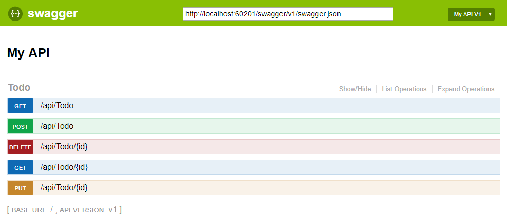

# Testing and Swagger and Deployment


# Table of contents


|Read No. | Name of chapter|
|:---------: |:--------------:|
|17|[ASP.NET Core web API documentation with Swagger](Swagger.md)|
|17|[Creating Unit Tests for ASP.NET MVC Applications (C#)](unit-tests.md)|
|17|[Unit test controller logic in ASP.NET Core](controllers-test.md)|


# ASP.NET Core web API documentation with Swagger

Swagger (OpenAPI) is a language-agnostic specification for describing REST APIs. It allows both computers and humans to understand the capabilities of a REST API without direct access to the source code. Its main goals are to:

- Minimize the amount of work needed to connect decoupled services.
- Reduce the amount of time needed to accurately document a service.

## OpenApi vs. Swagger
- OpenAPI is a specification.
- Swagger is tooling that uses the OpenAPI specification. For example, OpenAPIGenerator and SwaggerUI.

## OpenAPI specification (openapi.json)
The OpenAPI specification is a document that describes the capabilities of your API. The document is based on the XML and attribute annotations within the controllers and models. It's the core part of the OpenAPI flow and is used to drive tooling such as SwaggerUI. By default, it's named openapi.json. Here's an example of an OpenAPI specification, reduced for brevity:

```JSON
{
  "openapi": "3.0.1",
  "info": {
    "title": "API V1",
    "version": "v1"
  },
  "paths": {
    "/api/Todo": {
      "get": {
        "tags": [
          "Todo"
        ],
        "operationId": "ApiTodoGet",
        "responses": {
          "200": {
            "description": "Success",
            "content": {
              "text/plain": {
                "schema": {
                  "type": "array",
                  "items": {
                    "$ref": "#/components/schemas/ToDoItem"
                  }
                }
              },
              "application/json": {
                "schema": {
                  "type": "array",
                  "items": {
                    "$ref": "#/components/schemas/ToDoItem"
                  }
                }
              },
              "text/json": {
                "schema": {
                  "type": "array",
                  "items": {
                    "$ref": "#/components/schemas/ToDoItem"
                  }
                }
              }
            }
          }
        }
      },
      "post": {
        …
      }
    },
    "/api/Todo/{id}": {
      "get": {
        …
      },
      "put": {
        …
      },
      "delete": {
        …
      }
    }
  },
  "components": {
    "schemas": {
      "ToDoItem": {
        "type": "object",
        "properties": {
          "id": {
            "type": "integer",
            "format": "int32"
          },
          "name": {
            "type": "string",
            "nullable": true
          },
          "isCompleted": {
            "type": "boolean"
          }
        },
        "additionalProperties": false
      }
    }
  }
}
```

## Swagger UI
Swagger UI offers a web-based UI that provides information about the service, using the generated OpenAPI specification. Both Swashbuckle and NSwag include an embedded version of Swagger UI, so that it can be hosted in your ASP.NET Core app using a middleware registration call. The web UI looks like this:




# Creating Unit Tests for ASP.NET MVC Applications (C#)
The goal of this tutorial is to demonstrate how you can write unit tests for the controllers in your ASP.NET MVC applications. We discuss how to build three different types of unit tests. You learn how to test the view returned by a controller action, how to test the View Data returned by a controller action, and how to test whether or not one controller action redirects you to a second controller action.

## Creating the Controller under Test

Let's start by creating the controller that we intend to test. The controller, named the ProductController

```csharp
using System;
using System.Web.Mvc;

namespace Store.Controllers
{
     public class ProductController : Controller
     {
          public ActionResult Index()
          {
               // Add action logic here
               throw new NotImplementedException();
          }

          public ActionResult Details(int Id)
          {

               return View("Details");
          }
     }
}
```

The ProductController contains two action methods named Index() and Details(). Both action methods return a view. Notice that the Details() action accepts a parameter named Id.

## Testing the View returned by a Controller
Imagine that we want to test whether or not the ProductController returns the right view. We want to make sure that when the ProductController.Details() action is invoked, the Details view is returned. The test class in Listing 2 contains a unit test for testing the view returned by the ProductController.Details() action.

Listing 2 – ProductControllerTest.cs

```csharp
using System.Web.Mvc;
using Microsoft.VisualStudio.TestTools.UnitTesting;
using Store.Controllers;

namespace StoreTests.Controllers
{
     [TestClass]
     public class ProductControllerTest
     {
          [TestMethod]
          public void TestDetailsView()
          {
               var controller = new ProductController();
               var result = controller.Details(2) as ViewResult;
               Assert.AreEqual("Details", result.ViewName);

          }
     }
}
```

The class in Listing 2 includes a test method named TestDetailsView(). This method contains three lines of code. The first line of code creates a new instance of the ProductController class. The second line of code invokes the controller's Details() action method. Finally, the last line of code checks whether or not the view returned by the Details() action is the Details view.

The ViewResult.ViewName property represents the name of the view returned by a controller. One big warning about testing this property. There are two ways that a controller can return a view. A controller can explicitly return a view like this:

```csharp
public ActionResult Details(int Id)
{
     return View("Details");
}
```

Alternatively, the name of the view can be inferred from the name of the controller action like this:

```csharp
public ActionResult Details(int Id)
{
     return View();
}
```
This controller action also returns a view named Details. However, the name of the view is inferred from the action name. If you want to test the view name, then you must explicitly return the view name from the controller action.

You can run the unit test in Listing 2 by either entering the keyboard combination Ctrl-R, A or by clicking the Run All Tests in Solution button. 

## Testing the View Data returned by a Controller
An MVC controller passes data to a view by using something called View Data. For example, imagine that you want to display the details for a particular product when you invoke the ProductController Details() action. In that case, you can create an instance of a Product class (defined in your model) and pass the instance to the Details view by taking advantage of View Data.

The modified ProductController in Listing 3 includes an updated Details() action that returns a Product.

Listing 3 – ProductController.cs

```csharp
using System;
using System.Web.Mvc;

namespace Store.Controllers
{
     public class ProductController : Controller
     {
          public ActionResult Index()
          {
               // Add action logic here
               throw new NotImplementedException();
          }

          public ActionResult Details(int Id)
          {
               var product = new Product(Id, "Laptop");
               return View("Details", product);
          }
     }
}
```

First, the Details() action creates a new instance of the Product class that represents a laptop computer. Next, the instance of the Product class is passed as the second parameter to the View() method.

You can write unit tests to test whether the expected data is contained in view data. The unit test in Listing 4 tests whether or not a Product representing a laptop computer is returned when you call the ProductController Details() action method.

Listing 4 – ProductControllerTest.cs

```csharp
using System.Web.Mvc;
using Microsoft.VisualStudio.TestTools.UnitTesting;
using Store.Controllers;

namespace StoreTests.Controllers
{
     [TestClass]
     public class ProductControllerTest
     {

          [TestMethod]
          public void TestDetailsViewData()
          {
               var controller = new ProductController();
               var result = controller.Details(2) as ViewResult;
               var product = (Product) result.ViewData.Model;
               Assert.AreEqual("Laptop", product.Name);
          }
     }
}
```

In Listing 4, the TestDetailsView() method tests the View Data returned by invoking the Details() method. The ViewData is exposed as a property on the ViewResult returned by invoking the Details() method. The ViewData.Model property contains the product passed to the view. The test simply verifies that the product contained in the View Data has the name Laptop.

## Testing the Action Result returned by a Controller
A more complex controller action might return different types of action results depending on the values of the parameters passed to the controller action. A controller action can return a variety of types of action results including a ViewResult, RedirectToRouteResult, or JsonResult.

For example, the modified Details() action in Listing 5 returns the Details view when you pass a valid product Id to the action. If you pass an invalid product Id -- an Id with a value less than 1 -- then you are redirected to the Index() action.

Listing 5 – ProductController.cs

```csharp
using System;
using System.Web.Mvc;
namespace Store.Controllers
{
     public class ProductController : Controller
     {
          public ActionResult Index()
          {
               // Add action logic here
               throw new NotImplementedException();
          }
          public ActionResult Details(int Id)
          {
               if (Id < 1)
                    return RedirectToAction("Index");
               var product = new Product(Id, "Laptop");
               return View("Details", product);

          }
     }
}
```

You can test the behavior of the Details() action with the unit test in Listing 6. The unit test in Listing 6 verifies that you are redirected to the Index view when an Id with the value -1 is passed to the Details() method.

Listing 6 – ProductControllerTest.cs

```csharp
using System.Web.Mvc;
using Microsoft.VisualStudio.TestTools.UnitTesting;
using Store.Controllers;
namespace StoreTests.Controllers
{
     [TestClass]
     public class ProductControllerTest
     {
          [TestMethod]
          public void TestDetailsRedirect()
          {
               var controller = new ProductController();
               var result = (RedirectToRouteResult) controller.Details(-1);
               Assert.AreEqual("Index", result.Values["action"]);

          }
     }
}
```
When you call the RedirectToAction() method in a controller action, the controller action returns a RedirectToRouteResult. The test checks whether the RedirectToRouteResult will redirect the user to a controller action named Index.


# Unit test controller logic in ASP.NET Core

## Unit tests of controller logic
Unit tests involve testing a part of an app in isolation from its infrastructure and dependencies. When unit testing controller logic, only the contents of a single action are tested, not the behavior of its dependencies or of the framework itself.

Set up unit tests of controller actions to focus on the controller's behavior. A controller unit test avoids scenarios such as filters, routing, and model binding. Tests that cover the interactions among components that collectively respond to a request are handled by integration tests. For more information on integration tests, see Integration tests in ASP.NET Core.

If you're writing custom filters and routes, unit test them in isolation, not as part of tests on a particular controller action.

To demonstrate controller unit tests, review the following controller in the sample app. The Home controller displays a list of brainstorming sessions and allows the creation of new brainstorming sessions with a POST request:

```csharp
public class HomeController : Controller
{
    private readonly IBrainstormSessionRepository _sessionRepository;

    public HomeController(IBrainstormSessionRepository sessionRepository)
    {
        _sessionRepository = sessionRepository;
    }

    public async Task<IActionResult> Index()
    {
        var sessionList = await _sessionRepository.ListAsync();

        var model = sessionList.Select(session => new StormSessionViewModel()
        {
            Id = session.Id,
            DateCreated = session.DateCreated,
            Name = session.Name,
            IdeaCount = session.Ideas.Count
        });

        return View(model);
    }

    public class NewSessionModel
    {
        [Required]
        public string SessionName { get; set; }
    }

    [HttpPost]
    public async Task<IActionResult> Index(NewSessionModel model)
    {
        if (!ModelState.IsValid)
        {
            return BadRequest(ModelState);
        }
        else
        {
            await _sessionRepository.AddAsync(new BrainstormSession()
            {
                DateCreated = DateTimeOffset.Now,
                Name = model.SessionName
            });
        }

        return RedirectToAction(actionName: nameof(Index));
    }
}
```

The HTTP GET Index method has no looping or branching and only calls one method. The unit test for this action:

Mocks the IBrainstormSessionRepository service using the GetTestSessions method. GetTestSessions creates two mock brainstorm sessions with dates and session names.
Executes the Index method.
Makes assertions on the result returned by the method:
A ViewResult is returned.
The ViewDataDictionary.Model is a StormSessionViewModel.
There are two brainstorming sessions stored in the ViewDataDictionary.Model.

```csharp
[Fact]
public async Task Index_ReturnsAViewResult_WithAListOfBrainstormSessions()
{
    // Arrange
    var mockRepo = new Mock<IBrainstormSessionRepository>();
    mockRepo.Setup(repo => repo.ListAsync())
        .ReturnsAsync(GetTestSessions());
    var controller = new HomeController(mockRepo.Object);

    // Act
    var result = await controller.Index();

    // Assert
    var viewResult = Assert.IsType<ViewResult>(result);
    var model = Assert.IsAssignableFrom<IEnumerable<StormSessionViewModel>>(
        viewResult.ViewData.Model);
    Assert.Equal(2, model.Count());
}
```

```csharp
private List<BrainstormSession> GetTestSessions()
{
    var sessions = new List<BrainstormSession>();
    sessions.Add(new BrainstormSession()
    {
        DateCreated = new DateTime(2016, 7, 2),
        Id = 1,
        Name = "Test One"
    });
    sessions.Add(new BrainstormSession()
    {
        DateCreated = new DateTime(2016, 7, 1),
        Id = 2,
        Name = "Test Two"
    });
    return sessions;
}
```
The Home controller's HTTP POST Index method tests verifies that:

When ModelState.IsValid is false, the action method returns a 400 Bad Request ViewResult with the appropriate data.
When ModelState.IsValid is true:
The Add method on the repository is called.
A RedirectToActionResult is returned with the correct arguments.
An invalid model state is tested by adding errors using AddModelError as shown in the first test below:

```csharp
[Fact]
public async Task IndexPost_ReturnsBadRequestResult_WhenModelStateIsInvalid()
{
    // Arrange
    var mockRepo = new Mock<IBrainstormSessionRepository>();
    mockRepo.Setup(repo => repo.ListAsync())
        .ReturnsAsync(GetTestSessions());
    var controller = new HomeController(mockRepo.Object);
    controller.ModelState.AddModelError("SessionName", "Required");
    var newSession = new HomeController.NewSessionModel();

    // Act
    var result = await controller.Index(newSession);

    // Assert
    var badRequestResult = Assert.IsType<BadRequestObjectResult>(result);
    Assert.IsType<SerializableError>(badRequestResult.Value);
}

[Fact]
public async Task IndexPost_ReturnsARedirectAndAddsSession_WhenModelStateIsValid()
{
    // Arrange
    var mockRepo = new Mock<IBrainstormSessionRepository>();
    mockRepo.Setup(repo => repo.AddAsync(It.IsAny<BrainstormSession>()))
        .Returns(Task.CompletedTask)
        .Verifiable();
    var controller = new HomeController(mockRepo.Object);
    var newSession = new HomeController.NewSessionModel()
    {
        SessionName = "Test Name"
    };

    // Act
    var result = await controller.Index(newSession);

    // Assert
    var redirectToActionResult = Assert.IsType<RedirectToActionResult>(result);
    Assert.Null(redirectToActionResult.ControllerName);
    Assert.Equal("Index", redirectToActionResult.ActionName);
    mockRepo.Verify();
}
```

For more info click this [ling](https://docs.microsoft.com/en-us/aspnet/core/mvc/controllers/testing?view=aspnetcore-2.1)